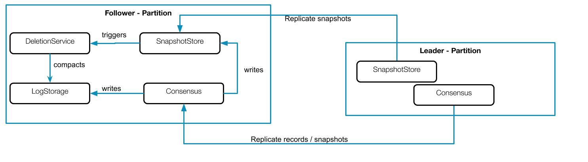
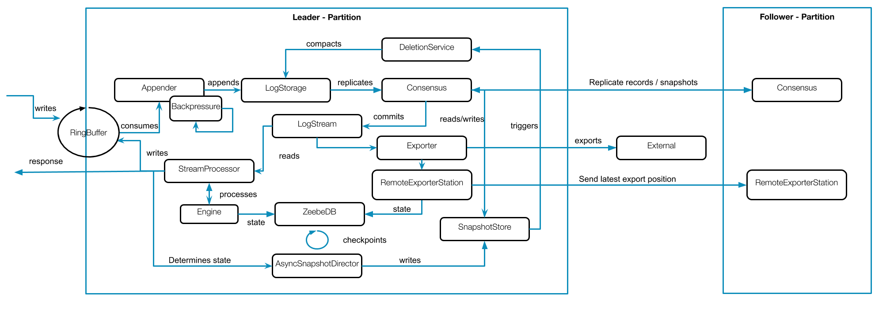
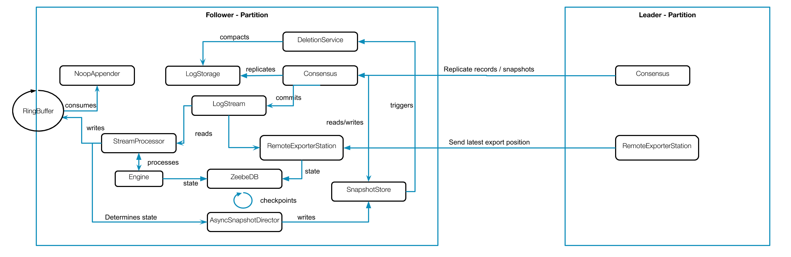

# Summary
[summary]: #summary

We should build state on followers to be more reliable, future prooven and enable fast fail-over.

# Motivation
[motivation]: #motivation

We currently have several issues with our snapshotting and replication strategy, some can be resolved
when we build state on followers. Issues which could be solved by building state on followers are:

 * Followers can only delete data if they received snapshots and if they are valid. In the past we had lot of bugs in snapshot replication which caused that followers where not able to delete.
 * Snapshot replication needs to be reliable, we need to use checksum's and send them via network plus the actual data.
 * We have two different snapshot replication implementations and we need to maintain them separately.
 * Periodically snapshot replication consumes bandwith and cpu, which could be used by several other components.
 * Large state will cause problems on periodically snapshot replication.

Periodically snapshot replication would be unnecessary, which is not only a problem on bigger state. Building state on Follower would enable us fast fail-over. We don't need to maintain multiple snapshot replication implementations. The implementation would be easier to understand, since most parts work in the same way unrelated to the raft role.

# Guide-level explanation
[guide-level-explanation]: #guide-level-explanation

As you can read in the [raft paper](https://raft.github.io/raft.pdf) chapter 7, compaction and taking a snapshot should
be done on each server.

> This snapshotting approach departs from Raft’s strong
leader principle, since followers can take snapshots without the knowledge of the leader. However, we think this
departure is justified. While having a leader helps avoid
conflicting decisions in reaching consensus, consensus
has already been reached when snapshotting, so no decisions conflict. Data still only flows from leaders to fol
lowers, just followers can now reorganize their data.
>
> We considered an alternative leader-based approach in
 which only the leader would create a snapshot, then it
 would send this snapshot to each of its followers. However, this has two disadvantages. First, sending the snapshot to each follower would waste network bandwidth and
 slow the snapshotting process. Each follower already has
 the information needed to produce its own snapshots, and
 it is typically much cheaper for a server to produce a snapshot from its local state than it is to send and receive one
 over the network. Second, the leader’s implementation
 would be more complex. For example, the leader would
 need to send snapshots to followers in parallel with replicating new log entries to them, so as not to block new
 client requests.

As the paper states it makes totally sense to build state and take snapshots of it on all servers unrelated of the raft state.

To better explain this topic we will use images from the [Zeebe-Overview](https://drive.google.com/drive/u/1/folders/13Orl4K_z-samdqTt8qHWotR2oPFjSN2a).

If we take for example a look at the leader and follower partition, which can be modeled in a simplified way like this:




We can see that the Leader partition contains most of the logic and needs to replicate the records and also the snapshots, which are taken periodically.

If we would build the state on followers, then the leader partition would look like this:



We see that we no longer replicate the latest snapshot, but still we need to replicate the last lowest exported position.
The exporter position is used to determine which is the last common position until we can delete the log.
_Alternatively we could run the exporters as well on followers, but this would increase the traffic in the cluster
and load on the external systems._

The follower partition would look like this:



It looks now quite similar to the leader partition. As written above the difference is that the exporters are not running on the follower, which means we need to distribute the lowest exporter position. This is done via a new component called `RemoteExporterStation` (names are discussable of course). On the follower this component just receives the position
and writes this to the state, on the Leader this component distributes the exporter position.

Another difference is that the Appender was replaced by a `NoopAppender`, which only consumes the entries from the RingBuffer and throw them away. The follower is not allowed to write to the corresponding log, but in order to generate the same positions we need to use the ring buffer and writers. 

With this changes the follower would be able build the state in the same way as the leader does (via stream processing) and we could remove our current periodically snapshot replication approach. The follower would be able to delete his log based on his
current state instead of relying on the snapshot replication. 

# Reference-level explanation
[reference-level-explanation]: #reference-level-explanation

In this reference level explanation we will discuss and explain the planed changes in more technical detail.

## Leader Partition

Currently the Leader partition can be drawn like this:


We know that the Leader partition contains most of the logic and needs to replicate the records and also the snapshots, which are taken periodically. If we would build state on the followers this would mean we could remove snapshot replication logic, which is currently triggered on the `SnapshotStore` after a new snapshot is taken.

In order to delete the log we need determine the last common position, based on the stream processor position and lowest exporter position. If the followers build there own state, they need to know the current lowest exporter position for this partition.
The probably easiest way would be to distribute this position via gossip. We will introduce a new component called `RemoteExporterStation`, the name is discussable. This component is called by the `ExporterDirector`, when the
export position is updated. This component will then share this information via gossip and store the position also in the corresponding `ExporterState`. 

The interface could for example look like this:

```java
public interface RemoteExporterStation extends ClusterMembershipEventListener {

  /**
  * Takes the newest exporter position, distributes it to its counter part and stores in the 
  * corresponding exporter state.
  */
  public void onNewExportPosition(long newExporterPosition); 
   /**
   * Triggered by gossip listener implementation to handle exporter position change.
   * Will update the corresponding exporter state.
   */
  public void receiveNewExporterPosition();
}
``` 

After changing the leader partition it would probably look like this:


## Follower Partition

The current follower partition looks like this:


As already mentioned the most logic and processing is part of the leader partition. When we build state on followers the partition would look quite similar.

They will differ only in two parts: exporters and not writing to the log.

On the `ZeebePartition` where we currently install the different partitions and actors we would still need to make a small difference.
We would install no exporters, but a component called `RemoteExporterStation`, which is used to receive the last exported position, see above for an example interface. When the component receives a new exporter position it will update the exporter state. This can then be use later, by our deletion components to determine what is the lowest common position. This works then in the same way as it does on the leader.

On installing a follower partition we would probably also install not the same Logstream as we currently do. 
We would need a logstream, which accepts to open writers and readers, but where the written events are not end in the backed logstorage. We might call it a *read-only* logstream, which contains an `LogStorageAppender`, which just consumes the `Dispatcher` but doesn't append the Blocks to th corresponding `LogStorage`. This is necessary such that the writers produce the same position in the `StreamProcessor`.

If we would have that the stream processing and snapshotting would look the same as on the leader side. The follower partition would then look like this:


## Possible Problems

### Slow Follower
If a follower is slower then the leader with processing and becomes later leader, this is not really a problem. It has indeed a snapshot with lower process position, but this is the same as we would increase the snapshot interval were snapshots are taken and replicated later. Our current reprocessing mechanism should handle that.

If the follower is to slow to receive events, then raft is in charge to send snapshots from the leader. Then we need to halt our processing actors. Install the snapshot and recover from it.

### Fast Follower
We might think it is a problem that if the follower is faster to process then the leader, because it stands on higher position and no event was created for that. 

This is also not really a problem, because we will not take a snapshot or make it valid until the last written event position is reached.
This means if this fast follower becomes leader only valid snapshots are used on recovery, this position have been reached by the old leader as well otherwise the snapshot can't be valid.

### Non-deterministic Event

When an exception is happening during processing then the current workflow instance will be blacklisted and a corresponding error event is written to the log. The processing continues only after the error event is committed. 

If we have such an event/exception on one node, it doesn't matter on follower or leader, then it might not happen on the other.
When the exception happend on the leader we are on the happy path, since the leader is able to write an error event. This can also be consumed by the follower later, and at least at this point the instance can be marked as blacklisted.

When the exception happens on a follower, we can't do much only update the state but we are not able to write an error event.

We have to think about if this is really possible, since we retry recoverable exceptions. All other exceptions will cause blacklisting, which means normally an bug/error in the code. This we expect to happen also on followers.

## Compatibility

This should not have any impact of the compatibility.

## Testing

We should test that snapshots are take on all servers and fail over is still possible. Furthermore I would expect that instances which are started on a leader will continue after fail-over.

### Integration

Snapshots are taken unrelated of the raft states.

### E2E

Test that fail-over is done without problems.

# Drawbacks
[drawbacks]: #drawbacks

It will take time and work, but I see no blocker.

# Rationale and alternatives
[rationale-and-alternatives]: #rationale-and-alternatives

If we not doing it we would still need to fix some of our current issues separately with appropriate solutions.

We could do only some of these things but we always limit ourself with this.
There is no real way around, if we want to support at the end also long running instances it makes no sense to transfer big snapshots periodically over the network.

# Prior art
[prior-art]: #prior-art

There are several raft implementation out there and all of them doing it in the same way
the state machine is running on all nodes and build the state and take snapshot and compact the log independently.

Other implementations

 * Hashicorp raft https://github.com/hashicorp/raft
 * etcd raft https://github.com/etcd-io/etcd/tree/master/raft
 * dragonboat https://github.com/lni/dragonboat
 
As we also saw above the Raft paper which mentions that this is the way how we should implement it.

# Out of scope
[out-of-scope]: #out-of-scope

# Unresolved questions
[unresolved-questions]: #unresolved-questions

 - What are possible problems and what is the impact which we currently not see?
 - What is a good X for triggering size based snapshotting?

# Future possibilities
[future-possibilities]: #future-possibilities

We might manage to replace the current implementation with something which is more bullet proven then our current one.
