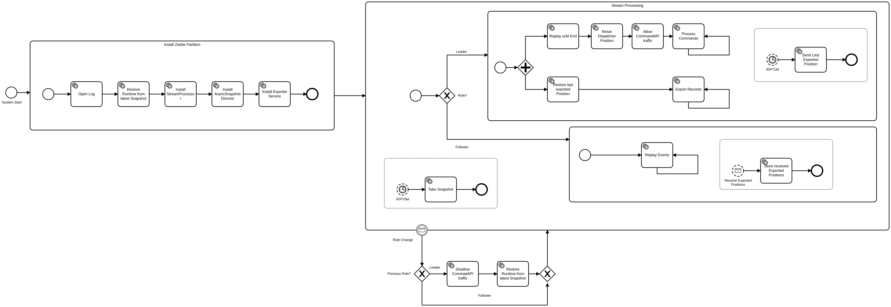
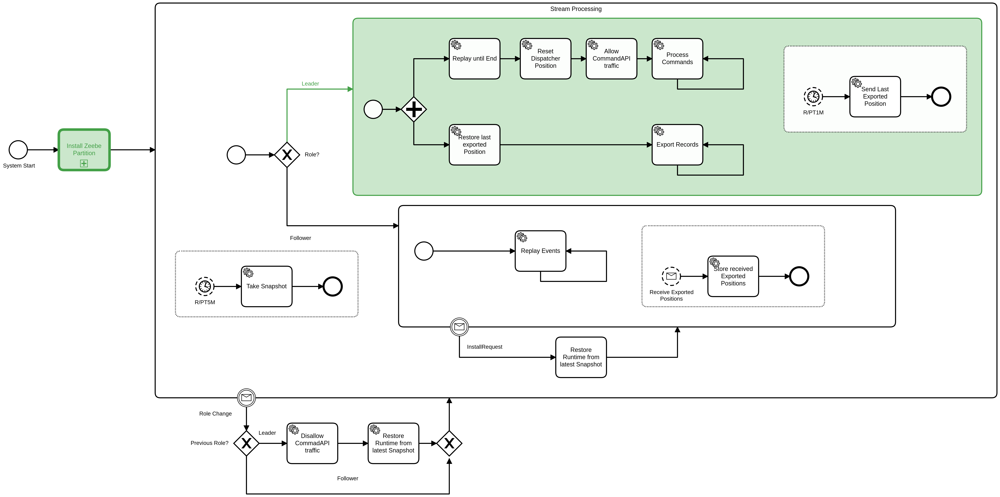
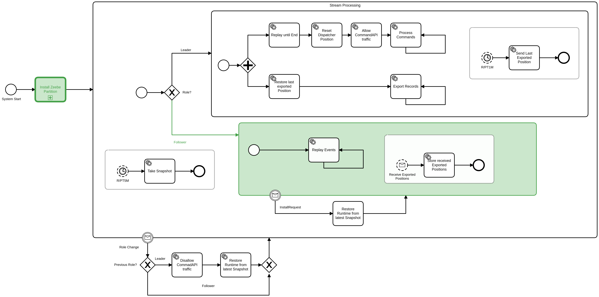
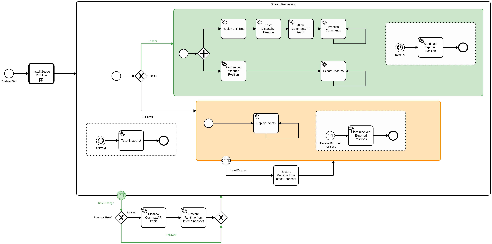
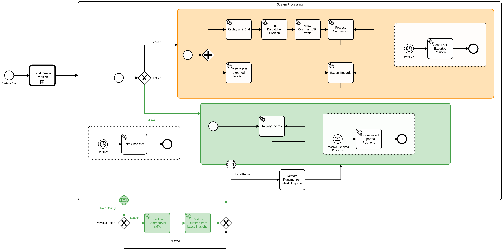

# Summary
[summary]: #summary

We should build state on followers to be more reliable, future proven and enable fast fail-over.

# Motivation
[motivation]: #motivation

Generally we want to reduce the failover time. With that we mean: the time between no leader is available, processing has stopped, and a new leader has been chosen and processing has started again. Especially we want to minimize the impact on process execution latency during failover on a partition. With this ZEP we want to decrease the time from node a becomes Leader until it starts to process new commands. This can be achieved with building state on followers.


In the screenshot above you can see the current impact of a leader change (fail-over), we want to reduce this gap. In this example it took ~ 2 minutes (from 16:00 to 16:02) to start processing again, which means after 2 minutes we can continue with the real process execution again.

There are other issues we can solve with building state on followers, which are related to our current snapshot replication strategy. Followers can only delete data if they received snapshots and if they are valid. This means our current snapshot and replication mechanism needs to be reliable. In the past we had plenty bugs in the snapshot replication, which caused that followers where not able to compact their log. Additionally, there is currently two different snapshot replication strategies, we need to maintain. All of that can be removed when we build state on followers.

Another interesting side effect is that not periodically sending the snapshots over the wire would bring us nearer to the ability to support large states, which is currently not possible.

# Guide-level explanation
[guide-level-explanation]: #guide-level-explanation

      
[comment]: <> (         Explain the proposal as if it was already included in the product and you were teaching it to another user/contributor. That generally means:)
[comment]: <> (         - Introducing new named concepts.)
[comment]: <> (         - Explaining the feature largely in terms of examples.)
[comment]: <> (         - Explaining how our users/contributors should *think* about the feature, and how it should impact the way they use our product. It should explain the impact as concretely as possible.)
[comment]: <> (         - If applicable, provide sample error messages, deprecation warnings, or migration guidance.)
[comment]: <> (         - If applicable, describe the differences between teaching this to existing users/contributors and new users/contributors.)
[comment]: <> (         For user facing ZEPs, this section should describe the benefits or changes the users will experience, from the point of view of the user.)
[comment]: <> (         For maintenance/non-user facing ZEPs, this section should focus on how other contributors should reason about the changes, and give concrete examples of its impact, both short term and long term.)
[comment]: <> (         For organizational ZEPs, this section should provide an example-driven introduction to the new policy or process, and explain its impact on the development process in concrete terms.)

Building state on follower's means, that since the follower already has the data on the replicated log, he consumes it similar to the Leader. This is done instead of replicating snapshots from the leader to the follower's. In this section I will describe and discuss the conceptional idea.

## Analogy

Imagine an office with three office workers working in it. There is one worker which is the Leader and two others can be seen as his backup.


They all have access to the records (documents), and the Leader worker is building a state based on the already processed records. He will regularly share the state of his already processed documents with the others.


If now the Leader is on vacation or sick someone else needs to take over. This might imply several problems.


If the Leader has forgotten to send the state before he left, one of the office worker, which takes over, might have a quite old state, and he needs to do a lot of rework. If the state is not readable he has also a problem to take over or there are documents missing etc.

In order to prevent such situations the idea is that each office worker, since they already have access to the documents (records), are building their own state. The Leader is only in charge of sending letters, invoices out etc. If now the Leader is not available another worker can take immediately over. To prevent not answering letters or answering twice, after take over, the Leader will mark documents as processed. The other workers will only build their state on already processed documents.

## Distinction to normal raft

As you can read in the [raft paper](https://raft.github.io/raft.pdf) chapter 7, compaction and taking a snapshot should be done on each server.

> This snapshotting approach departs from Raft’s strong
leader principle, since followers can take snapshots without the knowledge of the leader. However, we think this
departure is justified. While having a leader helps avoid
conflicting decisions in reaching consensus, consensus
has already been reached when snapshotting, so no decisions conflict. Data still only flows from leaders to fol
lowers, just followers can now reorganize their data.
>
> We considered an alternative leader-based approach in
which only the leader would create a snapshot, then it
would send this snapshot to each of its followers. However, this has two disadvantages. First, sending the snapshot to each follower would waste network bandwidth and
slow the snapshotting process. Each follower already has
the information needed to produce its own snapshots, and
it is typically much cheaper for a server to produce a snapshot from its local state than it is to send and receive one
over the network. Second, the leader’s implementation
would be more complex. For example, the leader would
need to send snapshots to followers in parallel with replicating new log entries to them, so as not to block new
client requests.

As the paper states it makes totally sense to build state and take snapshots of it on all servers unrelated of the raft state.

Unfortunately our processing state machine produces new commands, which need to be applied to the state machine again. This means that we can't just run the same processing state machine on all nodes, since only the leader should be able to create new records.

## State on Followers

Instead of running the same processing state machine on the followers, we replay the events from the replicated log. For that we have a ReplayStateMachine, which allows to continuously replay events and apply them to the state. We call it replay, since they have been already applied on the leader side and have been produced by him. Furthermore, we will reuse this state machine on bootstrap a leader partition such that the term "replay" makes sense here as well.

Raft ROLEs are transient states, which means it is likely that a Leader change happens. How the system reacts on these role changes can be seen in the following picture. With the following process, we minimize the time for the Follower-to-Leader transition, which impacts the process execution latency.



On bootstrapping of a Zeebe Partition we first install all needed services, like the StreamProcessor, the SnapshotDirector etc. In later images we will collapse the "Install Zeebe Partition" as call activity, to make it not so overwhelming. After installing our services we go over to a state we call "Stream Processing", which is our real business logic and the heart of each partition. Based on the RAFT role we perform different actions on the "Stream Processing". We can distinguish four cases which we will explain more in depth in the following sections:

  * Bootstrapping Leader Partition, no already running partition
  * Bootstrapping Follower Partition, no already running partition
  * Switch to Leader Partition, from an already running Follower partition
  * Switch to Follower Partition, from an already running Leader Partition.
  * Re-init Follower Partition, from an already running Follower Partition.

We can also represent that as the following state machine.


In the following section we will use the term processing and replay heavily, please read the [ZEP004](https://github.com/zeebe-io/enhancements/blob/master/ZEP004-wf-stream-processing.md) if you want to know more about it.

### Bootstrap Leader Partition



In this scenario we have no already running Zeebe partition and installed it completely new. During installing our services we restore the state, via copying the latest snapshot into the runtime folder. After installing all services, we start with the "Stream Processing", which is on the Leader separated in two parts. The first part is the processing, which consist of the following steps:

  * **Replay until end**, here we replay all existing events on the Log, which were not part of the Snapshot. This is necessary to get the latest state, before processing.
  * **Reset Dispatcher position**, here we set the Dispatcher position which generates the position for our follow-up events, and wipe all existing data.
  * **Allow Command API**, this means we're now accepting User commands being written to the Dispatcher, which will then later be processed.
  * **Process Commands**, we process commands in a loop and generate new follow-up commands and events. There is of course more behind that state, but as high level this should be enough.

The second part is the exporting, which consist of the following steps:

  * **Restore last exported Position**, we restore the last exported position from the state
  * **Export Records**, we continuously export all kind of records. Exporters, normally send data to an external system. 

In order to not run exporters on the followers, to avoid overhead, we communicate the last successful exported position for each exporter to the followers regularly. This makes it possible for the followers to rebuild the exporter state, such that after fail-over they can take over the exporting without re-exporting too much data. This is of course also necessary to be able to decide until which record we can compact our log, on the follower side.

Furthermore, as part of the general "Stream Processing" a Timer is scheduled which takes periodically a snapshot from the state.

### Bootstrap Follower Partition



In this scenario we have no already running Zeebe partition and installed it completely new. During installing our services we restore the state, via copying the latest snapshot into the runtime folder. After installing all services, we start with the "Stream Processing", which is on the Follower quite simple. 

Part of the Follower "Stream Processing" is the continuously applying of events, which is called **Replay Events**, since they already applied on the Leader. This avoids generating follow-up events on the follower. Only the Leader is allowed to write records, Single Writer Principle (SWP). Additionally, we can make sure that the follower is not faster than the leader, and we can easily switch to the Leader processing as we can see in the next section.

In distinction to the Leader, the Follower will not execute any exporters. It will receive periodically the last successful exported positions, which he stores in his state.

It can happen, if the follower is slow, or was not available for longer time that it receives an "InstallRequest" from the Leader. Such an "InstallRequest" contains the latest snapshot from the Leader. This is done to reduce the time the follower needs to catch up, or if the leader already has compacted his log. This scenario is described later [here](#re-init-follower-partition).

One of an edge case topic is the "Blacklisting" of process instances. This done on the Leader side, when during processing an error occurs. The related process instance, where the command corresponds to and caused this error, will be "Blacklisted". To persist that, an error event is written to the log. This kind of error events are applied on the follower replay mode to restore the blacklisted process instances. This is necessary such that we ignore on normal processing/applying of events related commands/events, otherwise we might end in an unexpected state. This restoring of the "Blacklist", is also done on the Leader replay mode.

Furthermore, as part of the general "Stream Processing" a Timer is scheduled which takes periodically a snapshot from the state.

### Switch to Leader Partition



In this scenario we have an already running Zeebe Partition, and we were Follower before. This means all our services have been already installed, and the Follower has executed the Replay mode. After switching to the Leader, we need to stop the replay and start with the Leader "Stream Processing". It is the same we have described [above](#bootstrap-leader-partition).

Interesting is the point that we need to replay all events until the end of the log in both cases, on bootstrap but also on switching to Leader. This is necessary to make sure that we applied all events from the **old** Leader, before we start with the general command processing.

As written above on the followers no exporters are running, but they get the latest exported position for each exporter from the leader send over the wire periodically. Based on this values the exporters can be re-stored on the new Leader. Be aware that we expect exporters to be able to handle duplicated records, they should be idempotent.

### Switch to Follower Partition



In this scenario we have an already running Zeebe Partition, and we were Leader before. This means all our services have been already installed, and the Leader has executed the command processing and exporting.

After switching to the Follower, we need to stop the processing, exporting and regularly sending of last exported positions. It might happen that we still write follow-up events to the log, because the RAFT role transition is already done, but the Zeebe Partition is notified asynchronous. This will be handled on the RAFT side, since it doesn't allow writing to the log if the node is not the leader. Still we should disallow new incoming user commands, via disabling the Command API. We could also think about having it always on, which would simplify it but this is out of scope.

One important part before we start with the Follower "Replay Mode" is that we need to restore the current state from the latest snapshot. This is necessary because when we process commands we immediately apply the follow-up events to our state, which we write to the log later. We can't be sure what we have already applied is committed, and to not apply events twice it is easier to just restore from the latest snapshot, KISS principle. Other than that it is similar to described [above](#bootstrap-follower-partition).

### Re-init Follower Partition

This can be seen as a special case and can also be called as Follower-To-Follower transition. In RAFT it can happen that InstallRequests are send to an slow Follower or to one which is lagging behind. In order to get the Follower back to the latest state, the Leader will send the Follower his latest snapshot.

The Follower will reset his log, such that no gaps in the log exist. The Leader will send log entries after the snapshot index to the follower only. In order to replay with the latest state and on the correct index and position it is necessary to completely reset the follower. The easiest way is to trigger a new follower transition, which is similar to [Bootstrap the Follower partition](#bootstrap-follower-partition). We just need to make sure that the received snapshot is copied into the runtime folder.

  
[comment]: <> (          We have several challenges we need to overcome to solve/implement build state on followers. Let's take a look of the following causality chain:)
[comment]: <> (           * To have a working and long living system, we need to be able to compact our log no matter the role. )
[comment]: <> (           * To compact our log, we need to be able to take snapshots from the state.)
[comment]: <> (             * The state need to contain a dense reflection of the log, last exported and processed position, from which we can recover.)
[comment]: <> (           * To take a snasphot from the state, we need to build the state on all participants &#40;leader and follower&#41; in order to not replicate it.)
[comment]: <> (           * To build state on followers, we need to avoid creating follow-up events by the state machine, Single Writer Principle. )
[comment]: <> (           * To avoid follow-up events, we need to either replay only or use a NoopWriter.)
[comment]: <> (In the following sections we will go in more depth in some these mentioned parts of the chain.)

### Compacting the log

In order to avoid an ever-growing log we need to compact it from time to time. This can be done by taking snapshots from the state, which allows us to start from that specific point, such that we can compact our log. With building state on followers each node is responsible for taking their own snapshots and compacting their log.

Part of the snapshot should be the last processed and last exported position for each exporter. The smallest number indicates until which position we can compact our log. In order to avoid running the exporters on all nodes and reduce the network load (since they export normally to an external system), the Leader has to periodically sync the last exported position to the followers. This is done via netty.

The last processed position corresponds to the last processed command on the leader **or** to the source position of last applied event on the follower.

#### Snapshotting


In order to take valid snapshots on the Leader we need to wait until the last written position of the stream processor is committed. This is necessary, because when we process a command we produce follow-up events, which correspond to our state changes. These state changes are immediately applied during processing, which means they will be part of the snapshot. In order to restore the same state on restart and not process or apply events twice we have to wait until the events, which we have written are committed.

On Follower's it is a bit different. The Follower applies events only. The last processed position here corresponds to the source position of the last applied event, which means the last written position corresponds here to the last applied event position. In general the follower doesn't need to wait until the last written position is committed, since he can already read committed entries anyway.

# Reference-level explanation
[reference-level-explanation]: #reference-level-explanation

[comment]: <> (       This is the technical portion of the ZEP. After reading it, a contributor should understand/know the following:)
[comment]: <> (       - [ ] The impact of the changes on other features is clear.)
[comment]: <> (       - [ ] The implementation is delineated)
[comment]: <> (       - [ ] Known corner cases are listed and addressed)
[comment]: <> (       The section should return to the examples given in the previous section, and explain more fully how the detailed proposal makes those examples work.)
[comment]: <> (       - [ ] Does the ZEP affect the official Zeebe distribution &#40;e.g. configuration, logging&#41;?)
[comment]: <> (       - [ ] Does the ZEP require coordination with the platform team?)
[comment]: <> (       - [ ] Does the ZEP require coordination with the Operate team?)


In this section we will describe the proposed implementation in more detail. It is expected to have a fundamental understanding of the proposed concept, which was described [previously](#guide-level-explanation) and also in the current Zeebe design and implementation. We did a POC which covers this concept pretty well, you can find the summary [here](https://github.com/camunda-cloud/zeebe/issues/7328#issuecomment-868503971) and the related branch [here](https://github.com/camunda-cloud/zeebe/tree/zell-7328-poc-state-on-followers).

## Replay State Machine

In this section we will go into more detail how the so called `ReplayStateMachine` should look like.
We will describe the functionality and how it works based on the following process model. The model is a simplified version. For example, the "Read Next Event" covers some details like filtering out records which are not events etc.


When starting the state machine we will first seek to the snapshot position (or start from begin if there is none). After that we try to read the next event, filtering out other types of records. If there is no event, which can be applied, then we will check whether we are in a continuous replay mode or not.

On a Leader we just want to replay until the end of the log, to replay all remaining events to build up the latest state and then end the replay. Afterwards the Leader will go into the processing mode.

The continuous replay is happening on the followers. If they reach the end of the log they are waiting for new events to be committed, after this has happened the `ReplayStateMachine` will be triggered again. In order to achieve this kind of triggering `CommitListeners` are used, see next sub-section for more details.

If there exist an event on "Read next Event", then this will be applied to the current state. After applying the state changes, the transaction will be committed. On both stages errors can happen, to be deterministic an endless retry strategy is used. We expect that errors should only be temporary. Otherwise, the event wouldn't be written to the log in the first place, the leader was able to apply that event to his state before. There are several possibilities to improve this approach, but this is out of scope.

Error events are replayed similar to other events, which means we will rebuild the blacklist on replay as well.

### Commit Listeners

As mentioned before, we need the commit listeners on the follower side to trigger our continuous replay. The same strategy we use on the Leader side for our [ProcessingStateMachine](https://github.com/camunda-cloud/zeebe/blob/develop/engine/src/main/java/io/camunda/zeebe/engine/processing/streamprocessor/ProcessingStateMachine.java). Furthermore, the commit listener is used for taking snapshots. We await that a certain position (lastWrittenPosition) is committed until we mark a snapshot as valid. See related [section](#snapshotting).

The `CommitListener` we use for these components, expect entries especially positions to be committed, but internally in RAFT we commit indexes. This is the reason why we need some glue code to translate indexes to position's.

In order to explain that more in detail, we first need a basic understanding how a RaftEntry looks like and what an index is, for that we can take a look at the following picture.


RAFT entries are written to the log. Each entry contains an index, which can be seen as the identifier of such an entry. Indexes are incremented by one. There are multiple types of raft entries, here we will just concentrate on an raft entry which contain application entries. The `IndexedRaftEntry` can contain multiple application entries. The application entries are sorted in a raft entry. The raft entry knows the lowest and highest position, which references the first and last application entry. 

In RAFT these entries are replicated via `AppendRequests` by the Leader. An `AppendRequest` looks like this:

```
AppendRequest {
  long term
  String leader
  long prevLogIndex
  long prevLogTerm
  List<PersistedRaftRecord> entries
  long commitIndex
}
```

An [AppendRequest](https://github.com/camunda-cloud/zeebe/blob/develop/atomix/cluster/src/main/java/io/atomix/raft/protocol/AppendRequest.java) can contain multiple raft entries. If the quorum is reached for a certain index, the index can be committed. The last committed index is shared together with the raft entries via an `AppendRequest`.


If the Leader commits an index it can immediately call the RAFT commit listeners with the corresponding `IndexedRaftEntry`. This is necessary, since we need to translate the index of the committed entry into a committed position later. We can do this in the `AtomixLogStorage` via asking for the highest position, if the entry contains application entries. With this highest position we can set the commit position in our LogStream abstraction. The LogStream will then notify all our other commit listeners, which wait for the committed position.

On the follower it looks similar, but it works a bit different.


As written above, the follower receives `AppendRequests`, which will contain the last committed index. The committed index, does need to correspond to the entries which are sent via the `AppendRequest`. In order to be able to translate the index to the position, we need the `IndexedRaftEntry`. For that the Follower has a separate reader, which is always forwarded to the next committed index to get the latest committed IndexedRaftEntry, which he then uses to call the RAFT `CommitListeners`. The rest stays the same as on the Leader side.


The commit listeners are registered on our LogStream abstraction, which in the end wraps the `AtomixLogStorage` and `RaftLog`. On bootstrap of the LogStream abstraction it needs to register an own commit listener on the Raft side. 

*TODO* find a better solution


**TODO:** After doing prototype rewrite this section.

We can't reuse our current ReprocessingStateMachine, since it is written in a way such it doesn't support continuously replay. Currently, it is a one time thing. It scans the log for the last source position to determine, when it will stop with the replay. Furthermore, it collects error events to make sure the records are failing on reprocessing as well. Should be fixed with https://github.com/camunda-cloud/zeebe/issues/7270. We need a new ReplayStateMachine, which only consumes events continuously. The leader is the only one who is allowed to write commands and follow-up events, which ensures that the follower will not be faster than the leader.

       
## Compatibility

We see no issues with this proposal.

### Rolling updates

**TODO:** Describe Rolling updates

We can have various starting scenarios, like followers have the same log, one follower is lagging behind, all followers are lagging behind. When thinking about rolling updates we need to consider how these different scenarios affect the procedure and outcome. 

[comment]: <> (         This section should also list incompatible changes of Zeebe's public APIs, and make it explicit should there be any breaking changes.)
[comment]: <> (         Should there be any breaking changes, it should explicitly describe the migration path. Should there be no possible migration paths, it should instead explain why it is not possible, and why we decided that the benefits are worth breaking compatibility.)
[comment]: <> (         After reading this section, a contributor should know the following:)
[comment]: <> (         - [ ] Will it be possible to upgrade a Zeebe cluster?)
[comment]: <> (         - [ ] If applicable, what is the upgrade procedure? Is it automated?)
[comment]: <> (         - [ ] Does the ZEP break compatibility in the Go client?)
[comment]: <> (         - [ ] Does the ZEP break compatibility in `zeebe-client`?)
[comment]: <> (         - [ ] Does the ZEP break compatibility in `zeebe-bpmn-model`?)
[comment]: <> (         - [ ] Does the ZEP break compatibility in `zeebe-exporter-api`?)
[comment]: <> (         - [ ] Does the ZEP break compatibility in `zeebe-protocol`?)
[comment]: <> (         - [ ] Does the ZEP break compatibility in `zeebe-gateway-protocol`?)
[comment]: <> (         - [ ] Does the ZEP break compatibility in `zeebe-test`?)


## Testing


[comment]: <> (        You should describe what is the overall functionality that should be tested.)
[comment]: <> (        If you are omitting tests, explain why, and explain the impact if it fails, specifically the worst case scenario.)
[comment]: <> (        In each of the sections below, we should already list known cases that need to be tested in the final implementation, and at which level. The initial version here should be a best of effort: it is perfectly acceptable and expected that this section will be amended during implementation.)
        
### Unit

### Integration

  * We need to verify that the state is build on Leaders **AND** follower's. 
  * We need to make sure that the followers take snapshots and can compact their log.
  * We need to verify that the blacklisting is build up correctly on the follower side and that if it becomes leader it ignores related commands.
  * In general, we should verify that fail-over works as expected and that the followers are building there state correctly, such that a new Leader can use it.
  * After fail-over the new Leader should be able to export after the last lowest exporter position.
  * After fail-over the new Leader should be able to process after the last processed command.
  * InstallRequest's should be properly handled by followers, and they should continue with applying events after restoring the state.

### E2E

 In the E2E test we should verify similar things:

 * We should verify that fail-over work as expected and that the followers are building there state correctly. The leaders should be able to continue where the followers left of and there should be no issue on exporting records from the new leader.

### Benchmarks

Verify the improvements in process execution latency during fail-over and also the latency from Follower-To-Leader processing transition, which was the main goal.

# Drawbacks
[drawbacks]: #drawbacks

 * Followers need to do more work. Previously, a follower just received a new snapshot and applied the received events to the log. Now, a follower replays all events to build the state. This might have an impact on performance.
 * Generally the nodes will consume more resources.

# Rationale and alternatives
[rationale-and-alternatives]: #rationale-and-alternatives

[comment]: <> (      - Why is this design the best in the space of possible designs?)
[comment]: <> (      - What other designs have been considered and what is the rationale for not choosing them?)
[comment]: <> (      - What is the impact of not doing this?)

## NoopWriter

As an alternative, I thought about using an NoopWriter which felt less natural and more complex than creating a ReplayStateMachine.

This means we have a new writer type, which contains a strategy to write given records. Based on the RAFT role we can switch this strategy.

**On being leader:** It will write to the dispatcher, get the position and return it to the caller. If, the dispatcher is full it returns -1, then the caller will retry.

**On being follower:** We will have a separate reader (maybe it contains it), which will fill a map with <source to written> position entries. This map is consumed by the writer to get the right writtenPosition, which will be returned to the caller. The entry itself is ignored, not written.  If there is no entry for a position, it returns -1. The caller (ProcessingStateMachine) will retry. It is filled, when the Leader has committed the corresponding follow-up event. This makes it possible that the follower will not process more than the leaders.

### On becoming Leader

On fail-over the new Leader need to drain the map, before he can switch to normal mode. Furthermore, the dispatcher needs to be reset. This allows to continue with the current state, without reinstalling any dependencies.

### On becoming Follower

If, the node was previously Leader, then the writer strategy will be replaced to no longer really write the entries. Possible race conditions can be handled on the RAFT level, since it detects whether a follower tries to write an entry. The new follower continuous processing, with the next command (it skips events) and fills with the reader the corresponding map.

## Exporter Records

Instead of sending the exported positions periodically over the wire, via SWIM, we could write the current state to the log. This can then be applied on the follower side to rebuild the exporter state, see related [issue](https://github.com/camunda-cloud/zeebe/issues/7088).

# Prior art
[prior-art]: #prior-art
     
[comment]: <> (      Discuss prior art, both the good and the bad, in relation to this proposal. A few examples of what this can include are:)
[comment]: <> (      - For language, library, tools, and UI proposals: Does this feature exist in other tools/products and what experience have their community had?)
[comment]: <> (      - For community proposals: Is this done by some other community and what were their experiences with it?)
[comment]: <> (      - For other teams: What lessons can we learn from what other communities have done here?)
[comment]: <> (      - Papers: Are there any published papers or great posts that discuss this? If you have some relevant papers to refer to, this can serve as a more detailed theoretical background.)
[comment]: <> (      This section is intended to encourage you as an author to think about the lessons from other languages, provide readers of your ZEP with a fuller picture. If there is no prior art, that is fine - your ideas are interesting to us whether they are brand new or if it is an adaptation from other languages.)
[comment]: <> (      Note that while precedent set by other products is some motivation, it does not on its own motivate a ZEP.)

There are several raft implementations out there and all of them doing it in the same way, the state machine is running on all nodes and build the state and take snapshot and compact the log independently.

Other implementations:

  * Hashicorp raft https://github.com/hashicorp/raft
  * etcd raft https://github.com/etcd-io/etcd/tree/master/raft
  * dragonboat https://github.com/lni/dragonboat

We also saw [above](#distinction-to-normal-raft) the Raft paper, which mentions that this is the way how we should implement it.

# Out of scope
[out-of-scope]: #out-of-scope

[comment]: <> (Call out anything which is explicitly not part of this ZEP.)

Building and supporting large states was not covered by this ZEP.

# Unresolved questions
[unresolved-questions]: #unresolved-questions
    
[comment]: <> (      - What parts of the design do you expect to resolve through the ZEP process before this gets merged?)
[comment]: <> (      - What parts of the design do you expect to resolve through the implementation of this feature before stabilization?)
[comment]: <> (      - What related issues do you consider out of scope for this ZEP that could be addressed in the future independently of the solution that comes out of this ZEP?)

 * What will the performance characteristics be?
   * We are pretty sure that the state building on followers will have a negative impact on the performance, but how bad we are not sure.

# Future possibilities
[future-possibilities]: #future-possibilities

[comment]: <> (      Think about what the natural extension and evolution of your proposal would be and how it would affect the language and project as a whole in a holistic way. Try to use this section as a tool to more fully consider all possible interactions with the project and language in your proposal. Also consider how this all fits into the roadmap for the project and of the relevant sub-team.)
[comment]: <> (      This is also a good place to "dump ideas", if they are out of scope for the ZEP you are writing but otherwise related.)
[comment]: <> (      If you have tried and cannot think of any future possibilities, you may simply state that you cannot think of anything.)
[comment]: <> (      Note that having something written down in the future-possibilities section is not a reason to accept the current or a future ZEP; such notes should be in the section on motivation or rationale in this or subsequent ZEPs. The section merely provides additional information.)
   
