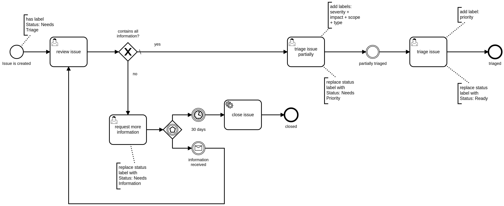

# Summary
[summary]: #summary

We introduce a process to triage issues, providing a clear overview of what will be worked on, the order in which issues will be worked on, and the impact of each issue on the project.

# Motivation
[motivation]: #motivation

The purpose of this process is two-fold:

1. Increase transparency into product decisions
2. Focus developer efforts

We hope that by assigning priority, severity, scope, and other labels, it will become clearer for both users and contributors alike to understand why certain issues are prioritized over others, as well as give them a rough idea of where their issues stand.

At the same time, in doing so, it becomes easier for us to track how we handle issues, and include issue management as part of our quarterly OKRs, thereby better focusing our development efforts, and making it more transparent how such resources are allocated.

# Scope
[scope]: #scope

This proposal is meant to serve as the primary guidelines when it comes to triaging issues for Zeebe, and is therefore only mandatory in Zeebe. It can however be used as a starting point for other projects.

# Guide-level explanation
[guide-level-explanation]: #guide-level-explanation

The triage process is focused on identifying, categorizing, and tracking the status of issues in Zeebe.

Issues go through three stages: not triaged, partially triaged, and triaged.

## Not triaged

When a new issue is created, it is not triaged. Issues in this state may not have all the information required to be properly triaged; in such a case, a developer should add an appropriate label, and notify the author.

## Partially triaged

> Any developer can partially triage an issue, and is encouraged to do so when they come across non triaged issues

A partially triaged issue contains the necessary information for the issue to be fully triaged, as well as:

- a type label (e.g. bug, enhancement, etc.)
- a scope label (e.g. broker, clients/java, etc.)

Type labels help to better prioritize issues, and together with scope labels, help contributors and authors alike to better narrow down what needs to be discussed, what information needs to be gathered, etc.
 
In the case of a bug report, it also needs to be assigned:

- a severity label (e.g. unusable with no workaround, unusable with complex workaround, etc.)
- an impact label (e.g. data loss, availability, etc.)

A severity label describes how badly a bug affects users, and an impact label describes the concrete impact it has. Both are particularly useful to help assign a priority to a bug.

## Triaged

> Final triage should be performed by a select committee (e.g. during weekly triage meeting)

An issue is determined to be triaged when it has been partially triaged and assigned a priority label. The goal is to provide users and stakeholders an estimate on how soon an issue will be worked on, and to help developers focus their efforts on the right issues. 

As such, priorities are associated with a time frame, which ranges from immediate (e.g. requires a patch release) to undefined (e.g. nice to have issues).

The final triage process is performed by a group which meets regularly. The group consists of the Zeebe product team, and Zeebe core developers are encouraged to join and take ownership of issues they have partially triaged.

# Reference-level explanation
[reference-level-explanation]: #reference-level-explanation

## Lifecycle of an issue

An issue goes through three stages from creation to close: not triaged, partially triaged, and triaged. To that end, a `Status` label will track the lifecycle of an issue.

| Label | Meaning | Example |
| -------- | -------- | -------- |
| Status: Needs Triage | the issue has not be reviewed by a developer yet | a user opens a new issue, or a developer opens a new issue but wants to discuss it before |
| Status: Needs Information | the issue has been reviewed by a developer, but needs more information to be properly triaged | a user opens a bug report but does not specify the Zeebe version, OS, or configuration they use |
| Status: Needs Priority | the issue has been partially triaged by a developer, but has not been assigned a priority yet | a developer creates a partially triaged issue, or evaluates a community contributed one, and adds this label |
| Status: Ready | the issue has been triaged and assigned a priority label | a user opened an issue, a developer partially triaged it, and the triage group assigned it a priority |
| Status: In Progress | the issue is actively being worked on | |
| Status: Needs Review | the issue has an open PR associated to it | |

### Not triaged

Initially, an issue is not triaged, meaning it hasn't been reviewed by any developer and may be lacking the required information to even partially triage it. At this stage, it has at least a single `Status: Needs Triage` label. To that end, the very first step is to get a developer to review the issue.

> Note using the correct issue template may already help in partially triaging an issue, but should not be considered a silver bullet.
> Additionally, if the issue was already created by a developer, it may already be partially triaged unless otherwise stated.

### Partial triaging

When reviewing an issue, the developer's first concern should be to gather the necessary basic information to help the triaging process. This means any information required to determine the type of the issue, its scope, and its priority. Additionally, if it is a bug report, enough information to ascertain its severity and impact on users.

If the necessary information is not available, the developer should gently request it from the author, and assign the `Status: Needs Information` label to the issue.

Once the basic required information has been gathered, the developer should then assign type and scope labels to the issue. If applicable, they can also add *to the best of their knowledge* an impact label. In the case of bug reports, they should also assign, *again to the best of their knowledge*, a severity label.

#### Type label

Type labels are particularly helpful when it comes to prioritize issues, as well as tracking the overall health of the project. They should be picked from one of the following:

| Label | Meaning | Example |
| -------- | -------- | -------- |
| Bug | technical issue that describes a bug report | "Cannot deploy workflow with intermediate catch event", "NullPointerException thrown on out of disk space in LeaderRole#append" |
| Enhancement | technical issue that describes a user facing feature request | "Intermediate message throw event", "API endpoint to see running workflows" |
| Maintenance | technical issue that describes non user facing changes | "Wrap all state changes of an event in a transaction", "Add integrity checks on snapshot operation" |
| Docs | issue that describes required changes to the documentation | "Document known metrics and the grafana dashboard", "Variables documentation is out dated" |
| Unstable test | a flaky test, that is, a test which sometimes passes and sometimes doesn't | |

#### Scope label

The scope label also allows us to better prioritize issues, as it helps determine the impact of an issue on the overall project. For example, a bug in the Go client most likely has little impact on the health of a broker, and can be prioritized differently than a data loss bug in the broker. Note that it is possible for issues to have more than one scope - for example, a protocol issue may affect both the broker and the gateway.

Scope labels should be picked from one of the following:

| Label | Meaning | Example |
| -------- | -------- | -------- |
| Scope: broker | the issue affects a component running in the broker | "Cannot deploy workflow with intermediate catch event", "NullPointerException thrown on out of disk space in LeaderRole#append" |
| Scope: gateway | the issue affects a component running in the gateway | "Gateway reports command API timeout after 1ms", "Gateway returns 503 on resource exhausted instead of 429" |
| Scope: clients/java | the issue affects the Java client | "Client is not using the jobTimeout property during configuration" |
| Scope: clients/go | the issue affects the Go client and/or zbctl | "Client is not using the given context on send" |

In the case of bug reports, severity and impact labels should be assigned, *to the best of the reviewer's knowledge*. During the triage meeting, these will be reassessed, but they are useful nonetheless to have beforehand.

#### Severity label

When assigning a severity label, ask yourself the following question:

- [ ] Does it lead to total system failure?
- [ ] Can it be prevented by using a workaround?
- [ ] Can the system recover from it?
- [ ] How likely is the it to happen to a random user?

With that in mind, pick the label from the table below that most closely fit:

| Label | Meaning | Example |
| -------- | -------- | -------- |
| Severity: Critical | high likelihood, total failure, unrecoverable, workaround is unacceptable | log corruption in the broker resulting in complete data loss |
| Severity: High | mid to high likelihood, total failure, (un)recoverable, workaround is complex | |
| Severity: Mid | the related scope is broken, but there is an acceptable workaround | cannot use an integer as a message name, but strings work |
| Severity: Low | refers to inconvenience, quality of life issues, nice to have's | variables can have a period in their name, resulting in confusing access patterns and mappings |

#### Impact label

> It's possible for an issue to have multiple impacts, in which case you can add more than one label.

| Label | Meaning | Example |
| -------- | -------- | -------- |
| Impact: Data | the bug results in data loss, data corruption, etc. | log corruption in the broker resulting in complete data loss |
| Impact: Availability | the bug results in a downtime, massive throughput degradation | all requests are rejected by the gateway, throughput drops by a factor of 10x after 2 hours of usage |
| Impact: Performance | the bug results in performance degradation | large max message size results in halved throughput |
| Impact: Integration | the bug impacts integration of Zeebe into existing infrastructure | Elasticsearch fails to export large terms, Stackdriver logging is broken |
| Impact: Usability | a user feature stops working | cannot deploy workflows with message catch events |

### Triaging

Once a week, a group of maintainers gets together and reviews issues that are not yet fully triaged, and triage them. For not triaged issues, this means first partially triaging them. For partially triaged issues, this means assigning a priority label.

As part of triaging, all critical and high priority issues are immediately assigned to one of the developers. While we try to assign issues based on developer interest, in the end it's important to remain "fair" and spread the work around as much as possible. Each developer is then in charge of managing their own time/back log; this means that if they are faster than expected, they're encouraged to mention it and take over some work from their team mates. Conversely, if for any reason some issues take longer, or an external issue arise, they should also mention it and the workload should be rebalanced.

#### Priority labels

Priority labels provide a way to couple issues with our release cadence, shaping users and stakeholder expectations, and allowing us to better focus our development efforts. Priority labels should be one of the following:

| Label | Meaning | Target |
| -------- | -------- | -------- |
| Priority: Critical | the issue is urgent, a stop the world, drop everything and fix it issue | next release, requires patch release |
| Priority: High | the issue is important and should be completed soon | next release |
| Priority: Mid | the issue is important and will be worked in the near future | in the next two releases | 
| Priority: Low | the issue is a nice to have, can be completed at a later point | not tied to any release |

### Adhoc and low priority issues caveat

While the goal of triaging is to focus development efforts on the highest priority issues, it is not the desire here to remove all agency from the development team. Each developer is free to, and encouraged to, exercise their own judgement when it comes to managing their time, and as such it's perfectly fine to work on some small issues here and there, or to bypass the triage process in some cases. However, when in doubt, defer to the triage process or confer with a senior developer.

### Process

> Note: the cawemo link will show you the latest version which may be out of date

## Compatibility

Existing issues should be partially triaged as a team effort, after which they should *all* be triaged by the committee.

## Testing

Feedback on the process should be collected towards the end of Q2-2020, and the process reviewed before Q3-2020 so any adjustements can be made and measured. Q3-2020 should include OKRs which will measure the impact of the process on our development workflow (e.g. "Should have fixed all urgent priority issues within their deadlines", etc.)

# Drawbacks
[drawbacks]: #drawbacks

This proposal introduces a non-negligible effort on the developer's part, especially as an initial time-consuming investment. It would be fair to argue against the introduction of a formal process, as the project as managed with an ad-hoc process so far.

# Rationale and alternatives
[rationale-and-alternatives]: #rationale-and-alternatives

This proposal was adapted for Zeebe from existing, successful issue triage guidelines, primarily those used by Kubernetes and GitLab. We acknowledge that it *will* need more iterations to perfect, and as such, it needs to be put to the test sooner than later.

Reusing the aforementioned guidelines would work, but would possibly not be as effective as they deal with different domains, and as such assign different severities, impacts, scopes, etc.

# Prior art
[prior-art]: #prior-art

This proposal is largely inspired by the [Kubernetes](https://github.com/kubernetes/community/blob/master/contributors/guide/issue-triage.md) and [GitLab triage](https://about.gitlab.com/handbook/engineering/quality/issue-triage/) guidelines, but the resources below also provided useful insights:

- https://github.com/chef/chef-oss-practices/blob/master/communication/triage.md and https://github.com/chef/chef-oss-practices/blob/master/repo-management/github-labels.md
- https://github.com/moby/moby/blob/master/project/ISSUE-TRIAGE.md
- https://forge.rust-lang.org/release/triage-procedure.html
- https://words.steveklabnik.com/how-to-be-an-open-source-gardener

# Out of scope
[out-of-scope]: #out-of-scope

This proposal does not address the PR process, or how issues are actually worked on, but simply how they are managed.

# Unresolved questions
[unresolved-questions]: #unresolved-questions

- How to handle orphaned issues where information is missing but the author is unresponsive?
- When is an issue definitively marked as not reproducible?
- Does it make sense to assign severity labels when really they are so close to priority? Is a checklist comment good enough to determine priority?
- How to test this other than via gut feeling? How to measure if this is really useful?
- How to handle flaky test duties?
- How to handle documentation issues?

# Future possibilities
[future-possibilities]: #future-possibilities

