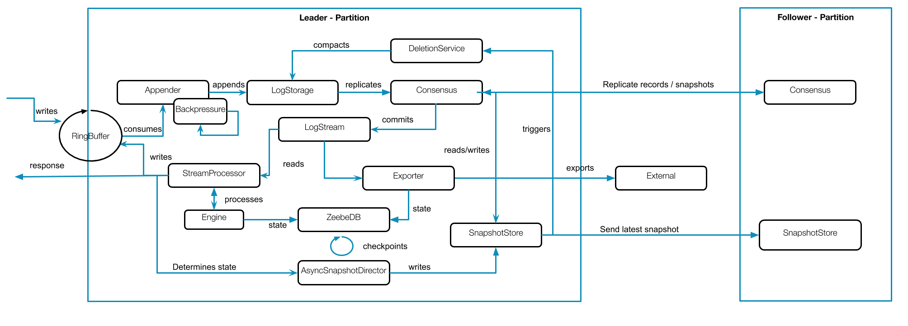
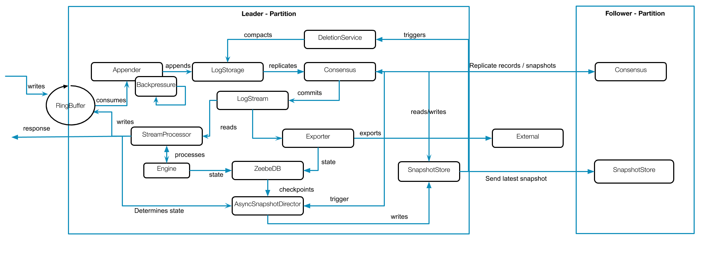

# Summary
[summary]: #summary

We propose to take snapshots load based instead of time based.  This would help us to prevent out of disk space in some cases, as well as better control on reprocessing time.

# Motivation
[motivation]: #motivation

We currently take snapshots on a fixed time interval, default every 15 minutes. This is problematic,
because:

 * we can't react on high disk usage
 * we might take snapshot unnecessary, on small load
 * it might happen a lot during this interval, which increases recovery time
 * we might not take any snapshot when we have periodical fail-overs before the snapshot interval, we have seen this before

Since we take snapshots time based this also means we compact time based, not load based.
The problems above can be solved if we would trigger the snapshotting directly in RAFT based on the
load and disk usage.

In the raft paper (_[Raft paper p. 13](https://raft.github.io/raft.pdf)_) this issue is highlighted as well
and it is proposed to do snapshots based on the current disk usage.

```
There are two more issues that impact snapshotting performance. First, servers must decide when to snapshot. If
a server snapshots too often, it wastes disk bandwidth and
energy; if it snapshots too infrequently, it risks exhausting its storage capacity, and it increases the time required
to replay the log during restarts. One simple strategy is
to take a snapshot when the log reaches a fixed size in
bytes. If this size is set to be significantly larger than the
expected size of a snapshot, then the disk bandwidth overhead for snapshotting will be small.
```

This makes also sense for our use case. With this approach we reduce some factors where we going out of disk space.
The reprocessing time becomes deterministic and journal recovery is more predictable and takes less time, since the journal doesn't grow so big as it does with the time based approach. We will always delete after the same amount. Furthermore we don't need logic to check whether we have processed something or not to take a new snapshot.

# Guide-level explanation
[guide-level-explanation]: #guide-level-explanation

Currently the leader partition looks like this:



The `AsyncSnapshotDirector` takes snapshots periodically. It requests information from the stream processor to mark the snapshot valid etc. The exporter state is used later to determine until we can compact.

With the load based approach the trigger comes from the consensus module.



We still have the dependency to the stream processor and exporter, but no longer periodically trigger from the `AsyncSnapshotDirector`. This would mean on higher load, we would take snapshots more often. This also means we replicate more often the related snapshots. If we build state on Follower's see ZEP-2 this problem would be mitigated.

If we have periodically fail-over we would still be able to trigger snapshot, when the disk usage is already high.https://github.com/zeebe-io/zeebe/issues/5116

# Reference-level explanation
[reference-level-explanation]: #reference-level-explanation

Instead of triggering a snapshot periodically at a fixed interval in the `AsyncSnapshotDirector` we propose to trigger a snapshot based on the load by Raft, specifically `AbstractAppender`. Here load means the number of new records that was processed after the last snapshot. Ideally we want at most ~ 1024 records to reprocess, such that the reprocessing becomes deterministic. We can count the appended records and trigger the snapshotting after reaching a threshold. As an approximation we propose to trigger the snapshotting after filling a new journal segment.

With that solution we mitigate the problem of triggering the snapshotting because other partitions have more load/data, which would happen if we just respect the disk usage.

There is a possible race condition with triggering only once, after filling an journal segment. It might happen that currently it is not possible to create a snapshot or that we are not able to compact, because exporters have not progressed. We need to retry the snapshotting in this case. In order to do that we introduce a new flag which indicates that we should await compaction and schedule an timer to retry.
This means, after we filled a journal segment we will trigger the snapshot, toggling the flag and scheduling the timer. The timer should be not to high to retry early, but also not to small since snapshotting takes time. It might make sense to start with a one minute timer.

After the snapshotting is triggered and the compaction was successful we will toggle the awaiting flag back and cancel the timer.
If the compaction was not successful, then on the next scheduled timer we will trigger snapshotting again. This will happen until the compaction was successful. In order to not create and replicate snapshots unnecessary we will introduce a new check, which verifies that since the last snapshot either the processing position or exporting position has changed by a value of `Y`. We need this check to avoid too many snapshots at once, since we currently directly replicate these snapshots. This problem mitigates if we build state on follower, see ZEP-2.

It might happen that we take a snapshot after updating the processed positions by a value of `Y`, but still not able to compact. This is OK, because at least we have taken a snapshot with higher processed position, which means it will be faster on reprocessing. The threshold `Y` should be configurable and a good value needs to be evaluated.

The start up time benefits from this approach and the reprocessing time is more predictable.

In summary snapshotting trigger logic is as follows
1. When a journal segment is filled, trigger snapshotting.
2. When snapshotting is triggered
    1. Cancel scheduled timer
    2. Try take a snapshot and compact
    3. If nothing was compacted, schedule a timer to trigger a snapshot
3. Snapshotting logic is as follows
    * Take snapshot if currentProcessedPosition - lastProcessedPosition > X OR currentExportedPosition - lastExportedPosition > Y


## Compatibility

This should not break compatibility.

## Testing

We should test:

 * snapshots are taken after a specific disk usage
 * snapshots are taken again after process or exporter position have changed by `Y`
 * compaction is done

### Unit Test

Test configuration.

### Integration & E2E

Test that snapshots are take after given load is reached and log is compacted afterwards.

# Drawbacks
[drawbacks]: #drawbacks

 * Replication could be done more often. Might be an issue on bigger state.
 * No snapshots on no load. I think this is fine, since we don't need to take a snapshot when nothing happens. Eventually
new appends will arrive and then we will take a snapshot again.

# Rationale and alternatives
[rationale-and-alternatives]: #rationale-and-alternatives

We keep it like it is, but we are not able to handle high load scenarios properly. We will still
have the issues which are pointed out above.

# Prior art
[prior-art]: #prior-art

There are several raft implementation out there and I think all of them doing it in the same way, since it
is also described in that way in the raft paper see above. I think it was also done in atomix before.

Other implementations

 * Hashicorp raft https://github.com/hashicorp/raft
    * https://github.com/hashicorp/raft/blob/master/snapshot.go#L116
 * etcd raft https://github.com/etcd-io/etcd/tree/master/raft
 * dragonboat https://github.com/lni/dragonboat

# Out of scope
[out-of-scope]: #out-of-scope

# Unresolved questions
[unresolved-questions]: #unresolved-questions

 - What are possible problems and what is the impact which we currently not see?
    - Would we end up taking snapshot too often? How does rocksdb checkpoints behave in this case?
    - What if the logSegmentSize is configured with a smaller value?
 - What is a good Y as threshold for taking next snapshots?
 - Does removing configuration options break backwards compatibility?
 - Should this be configurable? That is - user can configure when to trigger snapshot - after one segment or 10 segments?

# Future possibilities
[future-possibilities]: #future-possibilities

We might manage to replace the current raft implementation with something which is more bullet proven than our current one.
