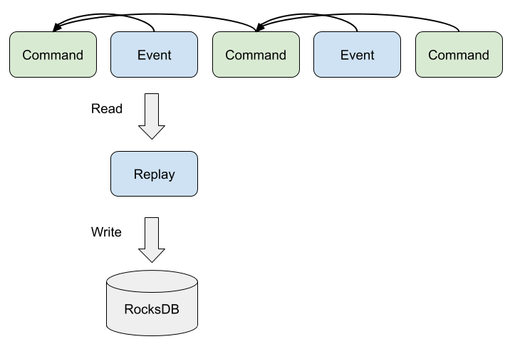
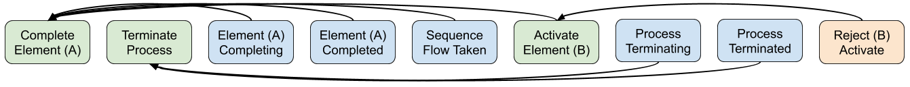
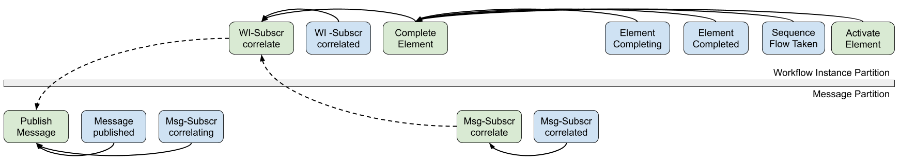

# Summary
[summary]: #summary

Defines how the workflow engine processes a stream of records, especially how the engine rebuilds its state after a restart.

# Motivation
[motivation]: #motivation

Currently, we are not able to process the records of a previous Zeebe version if some logic in the workflow engine has changed. The details are described in this issue [zeebe-io/zeebe#5581](https://github.com/zeebe-io/zeebe/issues/5581).

The behavior of the workflow engine when processing a record (event or command):
* read the state of the workflow instance and related resources (RocksDB)
* check if the record can be applied (i.e. concurrent update guard)
* apply the business logic  
* write follow-up events/commands to continue the processing
* write updates to the state, including the key generator
* apply side-effects (e.g. send a response)

When the broker is restarted then it first recovers its state from the latest
snapshot (i.e. RocksDB checkpoint). Afterwards, it reprocesses the records on
the stream that have already been processed before to rebuild its state. When
all records are reprocessed then it continues with the normal processing.

The behavior of the workflow engine when reprocessing a record:
* read the state of the workflow instance and related resources (RocksDB)
* check if the record can be applied (i.e. concurrent update guard)
* apply the business logic  
* write updates to the state, including the value/offset of the key generator 

The problem occurs when the business logic of the workflow engine changes (e.g. by fixing a bug, by implementing a new feature, etc.) and it writes different updates to the state on reprocessing. When the next record (of the workflow instance) is reprocessed then the state is different as it was before on processing. This may lead to a corrupted state, or the record can't be reprocessed successfully (e.g. it is rejected by the concurrent update guard, the state doesn't contain the expected data, etc.).  

To sum it up, the main problem is that the record is processed again on restarting, and it can't be guaranteed that it will rebuild the same state as the previous Zeebe version.     

The proposed solution should allow the processing of records of a previous Zeebe
version which is required for a rolling update of a Zeebe cluster.

# Guide-level explanation
[guide-level-explanation]: #guide-level-explanation

This chapter discusses the concepts of the proposal and how it tackles the
current issues with reprocessing and the updatability of the engine.

The **main idea** of the proposal is to avoid applying the business logic again on
reprocessing. Instead, the broker should apply only the state changes as they
were applied previously during processing.

In the domain of stream-processing/event-sourcing, this kind of rebuilding the state is known as **replay**. Comparing to reprocessing, the records are not processed again, only the state changes of the events are applied.

## Commands and Events

In order to extract the processing from the state changes, the **records** are split into commands, events, and rejections. 
* **Commands** represent the requests for change 
* **Events** represent the changes (i.e. what has happened)
* **Rejections** represent the requests that are not applied (i.e. invalid commands or preconditions are not met)   

Currently, we already have commands and events, but the records we use today do
not clearly exhibit these semantics. In particular, some records which we
consider to be events actually lead to the execution of business logic to
reproduce the state changes they represent, instead of capturing those state
changes as something that has already happened.

Rejections stay the same as the current approach. They are a necessary part to respond to the client and helps to understand the processing from an exporter's point of view. Especially for testing, we want to know when a command is not processed. Note that they are similar to events but there are a few differences. Semantically, a rejection doesn't represent a state change in the workflow processing (i.e. no change has happened). Technically, a rejection can be skipped on replay (i.e. no deserialization of the record value).

The following table shows how the BPMN Element records can be split into
commands and events. You can read this as: when processing the
`Activate_Element` command, we change the state and write the
`Element_Activating` and `Element_Activated` events that represent and contain
the state changes made by the processing of the `Activate_Element` command.

Commands | Events 
---|---
Activate_Element | Element_Activating
/ | Element_Activated 
Complete_Element | Element_Completing
/ | Element_Completed
/ | Sequence_Flow_Taken
Terminate_Element | Element_Terminating
/ | Element_Terminated

## Processing and Replay

Processing and replay are modes of the stream processor. Replay is part of the
stream processor's startup. Processing starts when replay is finished.
Processing is the stream processor's modus operandi.

The following diagram shows from left to right a stream consisting of command
and event records. Command records can only be processed, while event records
can only be replayed.

> The black arrow indicates that particular events and commands are appended to
> the stream as a result of processing a previous command (i.e. it represents
> the source record position - explained later in more detail). The orange box
> wrapping some records indicates that these were appended to the stream
> atomically.

### Activities during Processing

Only **commands** are processed. This drives the workflow execution. The
processing of a command includes:
* read the state of the workflow instance and related resources (RocksDB)
* check if the record can be applied (i.e. preconditions/concurrent update guard)
* apply the business logic  
* write updates to the state
* write events and (optionally) follow-up commands to continue the processing
* apply side-effects (e.g. send a response)

The following diagram shows the command processing loop.

### Activities during Replay

Only **Events** are replayed. This is done in order to rebuild the state. The
replay of an event includes:
* write updates to the state

The following diagram shows the event replay.

In order to rebuild the state with the events, it is necessary that all state changes from the command processing can be applied with the events only.
So, the command processing may only update the state when it also writes an event that reflects the state changes.

When the replay of the events is completed, the resulting state is exactly the
same as when processing stopped the last time.

### The Boundary between Replay and Processing

On restart, the stream processor replays all events of the stream, but ignores events that have a
source record position that is less than or equal to the last processed command
of the snapshot. The state changes of these events are already included in the
snapshot, because the commands are processed before the snapshot was created.
The replay ends when all events have been either replayed or ignored.

When the replay is done, then the processing starts on the first command that
has not yet been processed. A command is only considered to be processed if the
stream contains a record (a command, an event, or a rejection) with a source
record position referencing the command.

 

### Key Generation

A key (i.e. a long value) identifies an entity (e.g. a workflow instance). Most
records have a key, except for user commands that don't refer to an existing
resource (e.g. create workflow instance command). During the processing of a
command, when a new entity is created a key must be newly generated. The key can
then be used to refer to this entity in follow-up records.

On replay, the key generator must be restored to be able to generate new keys on
processing. To restore the key generator, we read all records on the stream to
find the latest key (i.e. the highest long value). Note, that the last record on
the stream might not hold the latest key, because it can refer to a previous
entity.

The restoring requires that all generated keys are also stored in records on the
stream (instead of only using the key as data in the state). In other words, we
should regard the generated keys to be part of the state and considering that
all state changes must be reflected in event records, this must also be true for
generated keys.

## State Transitions As Commands

The intent to transition from one state of an element instance to the next state
(i.e. `Activate_Element`, `Complete_Element`, `Terminate_Element`) is modeled as
a command. When processed, the resulting state changes are written as events
(e.g. the processing of the `Activate_Element` command results in the
`Element_Activating` and `Element_Activated` events). In some cases, activated
elements can be completed automatically (e.g. exclusive/inclusive gateway). In
which case, a follow-up state transition command is written to drive the
workflow execution.

For the processing of a state transition command, the events are split into an
intermediate state event (e.g. `Element_Activating`) and a terminal state event
(e.g. `Element_Activated`). This is useful when dealing with incidents. If an
incident is raised, only the intermediate state is produced and written as an
intermediate state event. This way the element is in a state where changes (like
creating variables on its scope) can be made, in order to resolve the incident.
If no incidents are raised, both the intermediate state and the terminal state
can be written without problems. This way the stream is consistent and
understandable for consumers, while also able to deal with incident resolution.

Sequence flows are somewhat part of the state transition of elements.
When leaving an element instance (i.e. processing the `Complete_Element`
command) with an outgoing sequence flow, we immediately mark the sequence flow
as taken (i.e. the `Sequence_Flow_Taken` event is written as part of the
processing of a `Complete_Element` command, just like the `Element_Completing`
and `Element_Completed` events).

Follow-up commands can be rejected (see next paragraph). Therefore, the
processing of a command must include only those state changes that are reflected
by its follow-up events. It must not include state changes that are reflected by
its follow-up commands. For example, adding a new element instance to the state
when writing the follow-up command `Activate_Element`. Instead, the state
should be written as a result of processing the `Activate_Element` follow-up
command.

The commands split the workflow processing into different parts, like transaction boundaries. The processing of one command is atomic (i.e. all follow-up records and state changes must be written at once). The next command may be processed later, as a separate transaction.

## Concurrent Commands and Rejections

During the processing of a command, follow-up commands are written to drive the
workflow execution. Other stream writers can simulteously append commands to the
stream. It can happen that multiple commands on the stream represent requests
for changes that are conflicting with each other. Processing the first disables
our ability to successfully process the others. In that case, the processor
rejects the other commands and doesn't apply their business logic.

Consider a user interrupting a workflow instance's execution using a
`WorkflowInstance:Terminate` command. By the time the `Terminate` command is processed,
other state transition commands referring to that workflow instance may have
been appended to the stream. They can no longer be processed, because the
workflow instance has been terminated.

    

Other examples of conflicting concurrent commands are:
* triggering an interrupting boundary event
* triggering multiple events of an event-based gateway

To deal with this, the processor checks the preconditions of a command to avoid
concurrent modifications, before processing the command. For example, if the
element instance is still activated, or it was completed or terminated in the
meanwhile.

If the preconditions are not met, the processor rejects the command and doesn't
apply the business logic. The rejection is written as a follow-up record on the
stream. So, it is transparent for consumers of the stream (i.e. exporters) that
the processing of the command did not lead to the requested state changes.

## Dealing with Business Logic Changes

Let's look at an example scenario in which we update the engine with business
logic changes that leads to failure with the current stream processing, and how
this proposal resolves the problem.

Consider a compacted stream `L` with records, where each record is numbered by
its position in the stream:

10. `CreateWorkflowInstanceIntent:Create{workflow: 1}`
11. `CreateWorkflowInstanceIntent:Created{workflow: 1, instance: 2}`
12. `Process:Element_Activating{instance: 2}`

And consider a snapshot `S1` containing the state after processing all records
up to (but excluding) the record at position 10. This state contains a deployed
workflow with workflow key `1` and a Process BPMN element. When the engine
restarts, only `L12` has not yet been processed.

### The Behavior of the current Engine
The state of `S1` is copied and reprocessing starts at `L10` (i.e. the record in
the stream with position 10).

First, during the reprocessing of `L10` a new workflow instance key `2` is
generated for the new workflow instance and this workflow instance is stored in
the state. Next, the reprocessing of `L11` is skipped, because there is no
processor for this record. Finally, processing starts again at `L12`, during
which the Process BPMN element of workflow `1` in workflow instance `2`
transitions to `Element_Activated`.

Now, let's make an imaginary bug fix in the key generation. From now, only odd
numbers are generated.

Updating to this new version from `S1` with reprocessing starting at `L10`,
results in a workflow instance with workflow instance key `3` in the state.
Then, reprocessing `L11` is skipped again (there is still no procesor for this
record). And lastly, when processing `L12`, there is a failure, because the
workflow instance with workflow instance key `2` cannot be found.

### The New Behavior
The state of `S1` is copied and replay starts at `L10`. We need to note
additionally, that `L10` and `L12` are commands, while `L11` is an event. In
addition, `L12` changes it's name to `Process:Element_Activating`.

First, `L10` is skipped, because commands are skipped during replay. Then,
during the replay of `L11`, a workflow instance is stored in the state with
workflow instance key `2` as described by the data inside `L11`. Finally,
processing starts again at `L12`, during which the Process BPMN element of
workflow `1` in workflow instance `2` transitions to `Element_Activated`.

Now, let's again make the same imaginary bug fix in the key generation. From
now, only odd numbers are generated.

Updating to this new version from `S1` with replay starting at `L10` results is
the same state as before the update. First `L10` is skipped, because commands
are skipped during replay. Then, during the replay of `L11`, a workflow instance
is stored in the state with workflow instance key `2` as described by the data
inside `L11`. Note, that this key is not newly generated, in which case it
would've had the value `3`. Finally, processing starts again at `L12`, during
which the Process BPMN element of workflow `1` in workflow instance `2`
transitions to `Element_Activated`.

Note, that in this case the workflow instance was correctly referred to from
`L12`, because the state changes recorded in the events were directly applied
instead of reapplying the business logic (which had changed).

This example also shows that the effect of this proposal is that bug fixes in
the form of business logic changes can no longer be utilised on the processing
of records that have already been processed previously. Their situation will not
be altered since the event have already been written to the stream and replay of
these events is not allowed to lead to different results.
 
### Record Versioning

A newly updated engine can encounter records from an older Zeebe version both
during processing and replay.

If there are differences in the data structure of the records between these
versions, then the processor or replayer should be able to deal with each record
accordingly. The Zeebe version of the records can be used to distinguish the
current from the legacy records. Based on the version, the command processor can
determine the business logic to apply; and the replayer can determine what
state changes to store.

New versions of Zeebe should be able to process and replay records written by
any of the previous (two minor) versions.

# Reference-level explanation
[reference-level-explanation]: #reference-level-explanation

This chapter describes and discusses some details how the workflow engine will work given the proposed
stream processing/replay.

Note that it focuses mainly of the developers that need to implement the changes. So, it doesn't describe all in detail and assumes deep knowledge of the current workflow engine.

## The Stream Processor

The state changes are written when processing a command or replaying an event.
In order to align the state changes that are written on processing a command
with the changes of replaying the resulting events, the implementation of these
parts should be coupled or reused. For example, implementing command
processing's logic for state changes by reusing the logic of applying state
changes for replay of events, instead of writing the changes while processing
the command on-the-fly.

Depending on the mode (processing or replay), the stream processor can skip a type of records. On processing, it reads only commands and skips events and rejections. On replay, it reads only events and skips commands and rejections. 

## BPMN Processing

The following examples show the sequence of records for a certain situation and explain the differences to the current behavior. 

Each example is presented as a table in which:
 - each row represents the atomic processing of a single command (`Deployment:Create` stands for a `Deployment` record with intent `Create`);
 - rows are ordered (from top to bottom) corresponding to the order of
   processing the commands;
 - events and follow-up commands wrapped in square brackets (e.g.
   `[Timer:Created]`) are optionally written (e.g. a `Deployment:Create` without
   timer start events will not result in `Timer:Created` events).

In addition to the table, notes are provided to clarify: the example; the state
changes on processing as well as on replay; the differences to the current
behavior; and considered design alternatives.

### Deploy workflow

The deployment processing has 2 interesting topics: distribution and start event
subscriptions.

#### Deployment distribution
**TODO REWORK**

  * CREATE DEPLOYMENT COMMAND on partition 1
      * Transforms deployment - creates Workflows
      * Follow up events for the workflows are written WorkflowRecord.CREATED
      * Deployment is distributed to other partitions 
      * Writes follow up event DISTRIBUTING for each partition
      * Writes follow up event CREATED for the deployment
  * CREATED WORKFLOW EVENT on partition 1
    * EVENT APPLIER: put workflow with all information to the state
  * CREATED DEPLOYMENT EVENT on partition 1
    * EVENT APPLIER: put deployment record into state (for re-distributing)
  * DISTRIBUTING DEPLOYMENT on partition 1
    * EVENT APPLIER: put deployment key and partition id into state (mark as pending)
  * DISTRIBUTE DEPLOYMENT command on other Partitions
    * write follow up deployment  DISTRIBUTED event
    * send response to deployment partition - causes FINISH_DISTRIBUTING command on partition 1
  * DISTRIBUTED DEPLOYMENT on other partitions
    * EVENT APPLIER: put deployment with workflows in state
  * FINISH_DISTRIBUTING command on partition 1
    * write follow up event DISTRIBUTING FINISHED
    * if last partition - cause another follow up event FULLY_DISTRIBUTED which marks the distribution completed on all partitions
  * DISTRIBUTING FINISHED event on partition 1
    * EVENT APPLIER: remove pending for specific partition
  * FULLY_DISTRIBUTED event on partition 1
    * EVENT APPLIER:  remove deployment record from state 
    
We will have listener which is called after recovery to go over the pending deployments, which then sends deployments again to remaining partitions.

Command to Process | Written Events and Follow-up Commands
---|---
Deployment:Create | Deployment:Created, [Deployment:Distribute]
Deployment:Distribute | Deployment:Distributed

Notes:
* workflows need to be available on all partitions, Therefore, the deployment
  needs to be distributed over all partitions. Only when processing the
  `Deployment:Create` command on the deployment partition, the
  `Deployment:Distribute` follow-up command is written.
* the processing of the `Deployment:Distribute` command sends a message to the
  other partition leaders. Each of these leaders then writes a
  `Deployment:Create` follow-up command. Since this is written on a different
  partition it is left out of the above table.

On processing:
* the `Deployment:Create` command deploys all workflows of the deployment (i.e. store them in the state) 
* the `Deployment:Distribute` command distribute the workflows to the other partitions but does not change state

On replay:
* the `Deployment:Created` event deploys all workflows in the deployment
* the `Deployment:Distributed` event does not change state

Considered alternatives:
* We could write a `Deployment:Distributed` for each partition it was
  distributed to, instead of only once when it is distributed to all partitions.
  Although this seems better, we don't feel we need this immediately. It's noted
  in [future possibilities](#future-possibilities).

#### Start event subscriptions
Subscriptions for timers and message start events at the root level of a
workflow are setup during the workflow deployment. In this example we ignore the
distribution, because this is already discussed above.

Command to Process | Written Events and Follow-up Commands
---|---
Deployment:Create | Deployment:Created, [MessageStartEventSubscription:Close], [MessageStartEventSubscription:Open], [Timer:Cancelled], [Timer:Created]
MessageStartEventSubscription:Close | MessageStartEventSubscription:Closed
MessageStartEventSubscription:Open | MessageStartEventSubscription:Opened

Notes:
* on processing the command `Deployment:Create`, we may need to close existing
  message start event subscriptions for previous versions of the same workflow
  and open new subscriptions for the new versions
* on processing the command `Deployment:Create`, we may need to cancel existing
  start event timers for previous versions of the same workflow and create new
  timers for the new versions

On processing:
* the `Deployment:Create` command deploys all workflows in the deployment,
  cancels existing start event timers for previous versions of the deployed
  workflows and creates new start event timers for the new version of the
  deployed workflows
* the `MessageStartEventSubscription:Close` command closes existing message
  start event subscriptions for previous versions of the deployed workflows
* the `MessageStartEventSubscription:Open` command opens new message start event
  subscriptions for the new version of the deployed workflows

On replay:
* the `Deployment:Created` event deploys all workflows in the deployment
* the `Timer:Canceled` event cancels existing start event timers for previous
  versions of the deployed workflows
* the `Timer:Created` event creates new start event timers for the new version
  of the deployed workflows
* the `MessageStartEventSubscription:Closed` event closes existing message start
  event subscriptions for previous versions of the deployed workflows
* the `MessageStartEventSubscription:Opened` event opens new message start event
  subscriptions for the new version of the deployed workflows

Differences to current processing:
* the events `Timer:Created` and `Timer:Cancelled` are produced by the command `Deployment:Create` instead of a `Timer:Create` / `Timer:Cancel` command because it can't be interrupted

### Create Workflow Instance

Command to Process | Written Events and Follow-up Commands
---|---
WorkflowInstanceCreation:Create | WorkflowInstanceCreation:Created, Process:Activate_Element
Process:Activate_Element | Process:Element_Activating, Process:Element_Activated, StartEvent:Activate_Element
StartEvent:Activate_Element | StartEvent:Element_Activating, StartEvent:Element_Activated, StartEvent:Complete_Element 
StartEvent:Complete_Element | StartEvent:Element_Completing, StartEvent:Element_Completed, Sequence_Flow_Taken, ServiceTask:Activate_Element 

Notes:
* the command `WorkflowInstanceCreation:Create` is the initial command and start of the workflow instance
* since the command `StartEvent:Complete_Element` produces the event `Sequence_Flow_Taken`, it must produce the next command `ServiceTask:Activate_Element` to activate the target activity of the taken sequence flow

On processing:
* the `WorkflowInstanceCreation:Create` command creates the new workflow
  instance
* the `Process:Activate_Element` command transitions the process element to
  activated
* the `StartEvent:Activate_Element` command transitions the start event to
  activated
* the `StartEvent:Complete_Element` command transitions the start event to
  completed and marks the sequence flow as taken

On replay:
* the `WorkflowInstanceCreation:Created` event creates the new workflow
  instance
* the `Process:Element_Activating` event transitions the process element to
  activating
* the `Process:Element_Activated` event transitions the process element to
  activated
* the `StartEvent:Element_Activating` event transitions the start event to
  activating
* the `StartEvent:Element_Activated` event transitions the start event to
  activated
* the `StartEvent:Element_Completing` event transitions the start event to
  completing
* the `StartEvent:Element_Completed` event transitions the start event to
  completed
* the `Sequence_Flow_Taken` event marks the sequence flow as taken
* processing can continue again at `ServiceTask:Activate_Element`

Differences to current processing:
* new commands for the state transitions of an element: `Activate_Element` and `Complete_Element`
* the event `Sequence_Flow_Taken` is produced by the command `StartEvent:Complete_Element`. There is no explicit command for the sequence flow (like `Take_Sequence_Flow`) because it can't be interrupted (i.e. no wait state)

### Service Task

Command to Process | Written Events and Follow-up Commands
---|---
ServiceTask:Activate_Element | ServiceTask:Element_Activating, [Variable:Created], ServiceTask:Element_Activated, Job:Created
JobBatch:Activate | JobBatch:Activated 
Job:Complete | Job:Completed, ServiceTask:Complete_Element
ServiceTask:Complete_Element | ServiceTask:Element_Completing, [Variable:Created], [Variable:Updated], ServiceTask:Element_Completed, Sequence_Flow_Taken, EndEvent:Activate_Element,

Notes:
* if the service task has an input variable mapping then it produces one or more `Variable:Created` events for the new local variables
* if the job is completed with variables then these variables will be stored in the state until they are used for the output mapping (i.e. temporal/transient variables). They must therefore also be written into the `Job:Completed` event.
* if the service task has an output variable mapping, or the job is completed with variables, then it produces one or more `Variable:Created`/`Variable:Updated` events for the new and updated variables of the workflow instance or scope

On processing:
* the `ServiceTask:Activate_Element` command transitions the service task
  element to activated, may create variables for input mapping and creates a job
* the `JobBatch:Activate` command activates a batch of jobs
* the `Job:Complete` command completes a job
* the `ServiceTask:Complete_Element` command transitions the service task
  element to completed, may create and/or update variables for output mapping
  and marks the sequence flow as taken

On replay:
* the `ServiceTask:Element_Activating` event transitions the service task element to activating
* the `Variable:Created` events create a variables for input mapping
* the `ServiceTask:Element_Activated` event transitions the service task element to activated
* the `Job:Created` event creates a job
* the `JobBatch:Activated` event activates a batch of jobs
* the `Job:Completed` event completes a job
* the `Variable:Created` events create variables for output mapping
* the `Variable:Updated` events update variables for output mapping
* the `ServiceTask:Element_Completing` event transitions the service task element to completing
* the `ServiceTask:Element_Completed` event transitions the service task element to completed
* the `Sequence_Flow_Taken` event marks the sequence flow as taken
* processing can continue again at `EndEvent:Activate_Element`

Differences to current processing:
* the event `Job:Created` is produced by the command `ServiceTask:Activate_Element` instead of a `Job:Create` command because it can't be interrupted

Considered alternatives:
* just like call activity variable propagation, we considered storing job
  variables in `TemporaryVariable:Created` events. However, we consider
  temporary variables an implementation detail and those should not be reflected
  in the stream.

### Multi-Instance Activity
 
The multi-instance processing has 2 interesting situations: sequential and
parallel. Both situations consider a sequential multi-instance marked service
task with an input collection of 2 elements.

#### Sequential Multi-Instance

Command to Process | Written Events and Follow-up Commands
---|---
MultiInstanceBody:Activate_Element | MultiInstanceBody:Element_Activating, MultiInstanceBody:Element_Activated, [Variable:Created (output collection)], [Variable:Created (input element)], [Variable:Created (output element)], Variable:Created (loop counter), ServiceTask:Activate_Element
ServiceTask:Complete_Element (first) | ServiceTask:Element_Completing, [Variable:Updated (output element)], ServiceTask:Element_Completed, [Variable:Updated (output collection)], [Variable:Created (input element)], [Variable:Created (output element)], Variable:Created (loop counter), ServiceTask:Activate_Element
ServiceTask:Complete_Element (last) | ServiceTask:Element_Completing, [Variable:Updated (output element)], ServiceTask:Element_Completed, [Variable:Updated (output collection)], MultiInstanceBody:Complete_Element
MultiInstanceBody:Complete_Element | MultiInstanceBody:Element_Completing, [Variable:Created (output collection)], MultiInstanceBody:Element_Completed, Sequence_Flow_Taken, EndEvent:Activate_Element

Notes:
* the command `MultiInstanceBody:Activate_Element` activates the first inner
  instance of the input collections
* the `MultiInstanceBody` element does not apply input mappings and output
  mappings like other elements
* the command `ServiceTask:Complete_Element` of an inner instance updates the
  output collection and activates the next inner instance
* the command `ServiceTask:Complete_Element` of the last inner instance
  completes the multi-instance body
* the multi-instance body has a loop counter to determine the current index in the input collection
* each inner instance has also a loop counter to determine the index for updating the output collection
* the loop counter is stored only in the state and not in the record; it needs to be restored on replay

On processing:
* the `MultiInstanceBody:Activate_Element` command transitions the multi
  instance body element to activated and creates the multi-instance variables
  (i.e. output collection, input element, output element and loop counter) for
  the first inner instance
* the `ServiceTask:Complete_Element` (first) command transitions the service
  task element of the first inner instance to completed, updates the output
  element, appends the output element to the output collection and creates the
  multi-instance variables for the next loop (i.e. intput element, output
  element and loop counter)
* the `ServiceTask:Complete_Element` (last) command transitions the service task
  element of the last inner instance to completed, updates the output element
  and appends the output element to the output collection
* the `MultiInstanceBody:Complete_Element` command transitions the multi
  instance body element to completed, propagates the output collection and marks
  the sequence flow as taken

On replay:
* the `MultiInstanceBody:Element_Activating` event transitions the multi
  instance body element to activating
* the `MultiInstanceBody:Element_Activated` event transitions the multi instance
  body element to activated
* the `Variable:Created` events create the multi-instance variables (i.e. output
  collection, input element, output element and loop counter) for the first
  inner instance
* the `ServiceTask:Element_Completing` event transitions the service task
  element of the first inner instance to completing
* the `Variable:Updated` (output element) event updates the output element
* the `ServiceTask:Element_Completed` event transitions the service task element
  of the first inner instance to completed
* the `Variable:Updated` (output collection) event appends the output element to
  the output collection
* the `Variable:Created` events create the multi-instance variables (i.e. output
  collection, input element, output element and loop counter)
* the `MultiInstanceBody:Element_Completing` event transitions the multi
  instance body element to completing
* the `Variable:Created` (output collection) event propagates the output
  collection
* the `MultiInstanceBody:Element_Completed` event transitions the multi instance
  body element to completed
* the `Sequence_Flow_Taken` event marks the output collection as taken
* processing can start again at `ServiceTask:Activate_Element`

#### Parallel Multi-Instance 
  
Command to Process | Written Events and Follow-up Commands
---|---
MultiInstanceBody:Activate_Element | MultiInstanceBody:Element_Activating, MultiInstanceBody:Element_Activated, [Variable:Created (output collection)], [Variable:Created (input element)], [Variable:Created (output element)], Variable:Created (loop counter), ServiceTask:Activate_Element, [Variable:Created (input element)], [Variable:Created (output element)], Variable:Created (loop counter), ServiceTask:Activate_Element
ServiceTask:Complete_Element (first) | ServiceTask:Element_Completing, [Variable:Updated (output element)], ServiceTask:Element_Completed, [Variable:Updated (output collection)]
ServiceTask:Complete_Element (last) | ServiceTask:Element_Completing, [Variable:Updated (output element)], ServiceTask:Element_Completed, [Variable:Updated (output collection)], MultiInstanceBody:Complete_Element
MultiInstanceBody:Complete_Element | MultiInstanceBody:Element_Completing, [Variable:Created (output collection)], MultiInstanceBody:Element_Completed, Sequence_Flow_Taken, EndEvent:Activate_Element

Notes:
* same as the sequential multi-instance but the command `MultiInstanceBody:Activate_Element` activates all inner instances at once

On processing:
* the `MultiInstanceBody:Activate_Element` command transitions the multi
  instance body element to activated and creates the multi-instance variables
  (i.e. output collection, input element, output element and loop counter) for
  all inner instances
* the `ServiceTask:Complete_Element` (first) command transitions the service
  task element of the first inner instance to completed, updates the output
  element and appends the output element to the output collection
* the `ServiceTask:Complete_Element` (last) command transitions the service task
  element of the last inner instance to completed, updates the output element
  and appends the output element to the output collection
* the `MultiInstanceBody:Complete_Element` command transitions the multi
  instance body element to completed, propagates the output collection and marks
  the sequence flow as taken

On replay:
* the `MultiInstanceBody:Element_Activating` event transitions the multi
  instance body element to activating
* the `MultiInstanceBody:Element_Activated` event transitions the multi instance
  body element to activated
* the `Variable:Created` events create the multi-instance variables (i.e. output
  collection, input element, output element and loop counter) for all inner
  instances
* the `ServiceTask:Element_Completing` event transitions the service task
  element of the first inner instance to completing
* the `Variable:Updated` (output element) event updates the output element
* the `ServiceTask:Element_Completed` event transitions the service task element
  of the first inner instance to completed
* the `Variable:Updated` (output collection) event appends the output element to
  the output collection
* the `MultiInstanceBody:Element_Completing` event transitions the multi
  instance body element to completing
* the `Variable:Created` (output collection) event propagates the output
  collection
* the `MultiInstanceBody:Element_Completed` event transitions the multi instance
  body element to completed
* the `Sequence_Flow_Taken` event marks the output collection as taken
* processing can start again at `ServiceTask:Activate_Element`

### Call Activity

The call activity processing has 2 important stages: activation and completion.

#### Activation
[call-activity-activation]: #call-activity-activation

Command to Process | Written Events and Follow-up Commands
---|---
CallActivity:Activate_Element | CallActivity:Element_Activating, WorkflowInstanceCreationIntent:Created, [Variable:Created], CallActivity:Element_Activated, Process:Activate_Element

On processing:
* the `CallActivity:Activate_Element` command transitions the call activity
  element to activated, creates the workflow instance for the child workflow,
  applies input mappings and copies the parent workflow instance's variables

On replay:
* the `CallActivity:Element_Activating` event transitions the call activity
  element to activating
* the `WorkflowInstanceCreationIntent:Created` event creates the workflow
  instance for the child workflow
* the `Variable:Created` event applies input mappings and copies the parent
  workflow instance's variables
* the `CallActivity:Element_Activated` event transitions the call activity
  element to activated
* processing can continue again at `Process:Activate_Element` since the
  workflow instance and its variables exists

Differences to current processing:
* on processing `CallActivity:Activate_Element`, a new event `WorkflowInstanceCreationIntent:Created` is written

Considered alternatives:
* processing the command `CallActivity:Element_Activating` could produce the
  `WorkflowInstanceCreationIntent:Create` follow-up command instead of the
  `WorkflowInstanceCreationIntent:Created` event, but in order to allow the
  copying of variables in a replayable manner this command's processing must
  then know that it was written due to a call activity element moving that
  responsibility into a more general place.

#### Completion

Command to Process | Written Events and Follow-up Commands
---|---
Process:Complete_Element | Process:Element_Completing, Process:Element_Completed, CallActivity:Complete_Element
CallActivity:Complete_Element | CallActivity:Element_Completing, [Variable:Updated], CallActivity:Element_Completed, Sequence_Flow_Taken, EndEvent:Activate_Element

On processing:
* the `Process:Complete_Element` command transitions the process element to
  completed and propagates the child workflow instance's variables as temporary
  variables
* the `CallActivity:Complete_Element` command transitions the call activity
  element to completed, applies the output mappings and marks the sequence flow
  as taken

On replay:
* the `Process:Element_Completing` event transitions the process element to
  completing
* the `Process:Element_Completed` event transitions the process element to
  completed and propagates the child workflow instance's variables as temporary
  variables
* the `CallActivity:Element_Completing` event transitions the call activity
  element to completing
* the `Variable:Updated` event applies the output mappings
* the `CallActivity:Element_Completed` event transitions the call activity
  element to completed
* the `Sequence_Flow_Taken` event marks the sequence flow as taken
* processing can continue again at `EndEvent:Activate_Element`

Considered alternatives:
* instead of propagating the child workflow instance's variables during the
  processing of the `Process:Complete_Element` command and the replay of the
  `Process:Element_Completed` event, we also considered writing
  `TemporaryVariable:Created` events to capture the stored state. However, we
  believe this is an implementation detail and there may exist better
  implementation solutions. Introducing new `TemporaryVariable` records would
  lead to breaking changes when improving this implementation. The current
  proposal better fits such an improvement, since it can be considered a
  business logic change.

### Cancel Workflow Instance 

Command to Process | Written Events and Follow-up Commands
---|---
Process:Terminate_Element | Process:Element_Terminating, ServiceTask:Terminate_Element (A), ServiceTask:Terminate_Element (B) 
ServiceTask:Terminate_Element (A) | ServiceTask:Element_Terminating (A), ServiceTask:Element_Terminated (A)
ServiceTask:Terminate_Element (B) | ServiceTask:Element_Terminating (B), ServiceTask:Element_Terminated (B), Process:Element_Terminated

On processing:
* the `Process:Terminate_Element` command transitions the process to terminating (and produces one `Terminate_Element` command for each active element instance)
* the `ServiceTask:Terminate_Element` (A) command transitions the service task to terminated
* the `ServiceTask:Terminate_Element` (B) command transitions the service task to terminated, and transitions the process to terminated (because it is the last active element instance)

On replay:
* the `Process:Element_Terminating` event transitions the process to terminating 
* the `ServiceTask:Element_Terminating` (A) transitions the service task to terminating
* the `ServiceTask:Element_Terminated` (A) transitions the service task to terminated
* the `ServiceTask:Element_Terminating` (B) transitions the service task to terminating
* the `ServiceTask:Element_Terminated` (B) transitions the service task to terminated
* the `Process:Element_Terminated` transitions the process to terminated

Differences to current processing:
* omit the `Process:Cancel` command because it doesn't have any additional business logic and don't fit to the life cycle (i.e. no `Canceled` event); instead cancel the workflow instance by writing a `Process:Terminate_Element` command 

#### Handle Concurrent Commands

If the command `Process:Terminate_Element` is written concurrently to another command of the same workflow instance (e.g. `Complete_Element` of a service task) then the other command (or a follow-up command of it) is rejected, and the workflow instance terminates eventually.

Example situations:

* if the `Process:Terminate_Element` command is written before the `Job:Complete` command then the `ServiceTask:Complete_Element` command is rejected
  * the `ServiceTask:Terminate_Element` command is written before the `ServiceTask:Complete_Element` command

* if the `ServiceTask:Complete_Element` command is written before the `Process:Terminate_Element` command then the `Activate_Element` of the next element is rejected
  * on processing the `Process:Terminate_Element` command, the process transitions to terminated directly because no element instance is active (element B is not activated yet - it is just a command)
  * reject the command `Activate_Element` of the next element because the process is already terminated

* if the `Process:Terminate_Element` command is written before the `ServiceTask:Complete_Element` command then the `ServiceTask:Complete_Element` is rejected
  * on processing the `Process:Terminate_Element` command, the process transitions to terminating
  * the `ServiceTask:Complete_Element` is rejected because the process (i.e. its flow scope) is on terminating
  

### Incident

Notes:
* an incident references the element instance where it occurred
* in order to solve the incident, local variables of the element instance or other variables of the workflow instance can be created or updated
* the incident is resolved by processing the failed command again in order to
  continue

#### Activate the Element Instance 

Command to Process | Written Events and Follow-up Commands
---|---
ServiceTask:Activate_Element | ServiceTask:Element_Activating, Incident:Created
VariableDocument:Update | Variable:Created/Updated
Incident:Resolve | Incident:Resolved, ServiceTask:Element_Activated, Variable:Created, Job:Created

Notes:
* on normal processing of the `ServiceTask:Activate_Element` command, the
    service task element transitions to activated
* if an incident is created then the service task element transitions to activating instead
* on resolving the incident, the processor processes the failed command based on the current state of the service task 

On processing:
* the `ServiceTask:Activate_Element` command transitions the service task to activating and creates an incident
* the `VariableDocument:Update` command creates or updates variables on the scope of the service task, or an upper scope  
* the `Incident:Resolve` command marks the incident as resolved (i.e. removes it), transitions the service task to activated, may create variables and creates a job

On replay:
* the `ServiceTask:Element_Activating` event transitions the service task to activating
* the `Incident:Created` event creates an incident
* the `Variable:Created/Updated` events create or update the variables
* the `Incident:Resolved` event marks the incident as resolved
* the `ServiceTask:Element_Activated` event transitions the service task to activated 
* the `Variable:Created` events create new variables
* the `Job:Created` event creates a job

Differences to current processing:
* omit the `Incident:Create` command and create the incident directly

Considered alternatives:
* no intermediate events for state transitions (`Element_Activating` + `Element_Completing`) 
  * write just a command and one follow-up event (`Activate_Element` => `Element_Activated`)
  * on replay, the `Incident:Created` event (and on processing the command that writes this event) transitions the service task to activating in order to allow variable updates of this scope
  * the `Incident:Created` event contains the failed command (i.e. all required
    data like the intent) in order to process the command again on resolving the
    incident
  * if an incident is created on processing the `Activate_Element` command then it is not obvious from a consumer of the stream that the element instance exists already and is in an activating state
  * produces less events but requires more logic on reply 

#### Complete the Element Instance

Command to Process | Written Events and Follow-up Commands
---|---
Job:Complete | Job:Completed, ServiceTask:Complete_Element
ServiceTask:Complete_Element | ServiceTask:Element_Completing, Incident:Created
VariableDocument:Update | Variable:Created/Updated
Incident:Resolve | Incident:Resolved, Variable: Created/Updated, ServiceTask:Element_Completed, Sequence_Flow_Taken, EndEvent:Activate_Element 

On processing:
* the `Job:Complete` command completes the job  
* the `ServiceTask:Complete_Element` command transitions the service task to completing and creates an incident
* the `VariableDocument:Update` command creates or updates variables on the scope of the service task 
* the `Incident:Resolve` command marks the incident as resolved (i.e. removes it), transitions the service task to completed and may create variables

On replay:
* the `Job:Completed` event completes the job
* the `ServiceTask:Element_Completing` event transitions the service task to completing
* the `Incident:Created` event creates an incident
* the `Variable:Created/Updated` events create or update the variables
* the `Incident:Resolved` event marks the incident as resolved
* the `Variable:Created` events create new variables
* the `ServiceTask:Element_Completed` event transitions the service task to completed 

#### Fail a Job with No Remaining Retries

Command to Process | Written Events and Follow-up Commands
---|---
Job:Fail | Job:Failed, Incident:Created
[VariableDocument:Update] | Variable:Created/Updated
Job:Update_Retries | Job:Retries_Updated
Incident:Resolve | Incident:Resolved 

On processing:
* the `Job:Fail` command marks the job as failed and creates an incident
* optionally, the `VariableDocument:Update` command creates or updates variables on the scope of the service task, or an upper scope
* the `Job:Update_Retries` commands increases the remaining job retries
* the `Incident:Resolve` command marks the incident as resolved (i.e. removes it) and marks the job as activatable again

On replay:
* the `Job:Failed` events marks the job as failed
* the `Incident:Created` event creates an incident
* the `Variable:Created/Updated` events create or update the variables
* the `Job:Retries_Updated` event increases the remaining job retries
* the `Incident:Resolved` event marks the incident as resolved (i.e. removes it) and marks the job as activatable again

### Interrupting Timer Boundary Event

Command to Process | Written Events and Follow-up Commands
---|---
ServiceTask:Activate_Element | ServiceTask:Element_Activating, ServiceTask:Element_Activated, Timer:Created, Job:Created
Timer:Trigger | Timer:Triggered, ServiceTask:Terminate_Element
ServiceTask:Terminate_Element | ServiceTask:Element_Terminating, ServiceTask:Element_Terminated, BoundaryEvent:Activate_Element 
BoundaryEvent:Activate_Element | BoundaryEvent:Element_Activating, BoundaryEvent:Element_Activated, BoundaryEvent:Complete_Element

On processing:
* the `ServiceTask:Activate_Element` command transitions the service task
  element to activated, creates and schedules a timer, and creates a job
* the `Timer:Trigger` command triggers the timer, marks the event subscription on the element as triggered, and removes other open event subscriptions from the element
* the `ServiceTask:Terminate_Element` transitions the service task element to terminated
* the `BoundaryEvent:Activate_Element` command transitions the boundary event
  element to activated

On replay:
* the `ServiceTask:Element_Activating` event transitions the service task element to activating
* the `ServiceTask:Element_Activated` event transitions the service task element to activated
* the `Timer:Created` event creates the timer and schedule it
* the `Job:Created` event creates a job
* the `Timer:Triggered` event marks the timer as triggered, marks the event subscription on the element as triggered, and removes other open event subscriptions from the element
* the `ServiceTask:Element_Terminating` event transitions the service task element to terminating
* the `ServiceTask:Element_Terminated` event transitions the service task element to terminated
* the `BoundaryEvent:Element_Activating` event transitions the boundary event element to activating
* the `BoundaryEvent:Element_Activated` event transitions the boundary event element to activated

Differences to current processing:
* the `ServiceTask:Activate_Element` command creates the timer directly without a `Timer:Create` command
* the `Timer:Trigger` command terminates the element directly without writing an
  `Event_Occurred` event for the element in between. The `Event_Occurred` event
  is written in the current processing, but will be removed

Handling of concurrent commands:

* if the `Timer:Trigger` command is written before the `Job:Complete` command 
then the job command is rejected
* on processing the `Timer:Trigger` command or on replay the `Timer:Triggered` event, the processor removes the job subscription of the service task
* on processing the `Job:Complete` command, the processor doesn't find a job subscription and rejects the command

* if the `Job:Complete` command is written before the `Timer:Trigger` command 
then the timer command is rejected
* on processing the `Job:Complete` command or on replay the `Job:Completed` event, the processor removes the timer subscription of the service task 
* on processing the `Timer:Trigger` command, the processor doesn't find a timer subscription and rejects the command

### Event Sub Process

The event sub process element can be triggered by timer, message and error
events. It can be either interrupting or non-interrupting. The non-interrupting
form is relatively simple. Commands that activate event elements on processing
(i.e. `Timer:Trigger` for timer events or
`WorkflowInstanceSubscription:Correlate` for message events), simply activate
the corresponding start event element of the event sub process by writing a
`StartEvent:Activate_Element` command, thereby forking the execution of that
workflow instance.

Interrupting event sub processes require similar behavior as interrupting
boundary event events, because they are logically equivalent to interrupting
boundary events attached to the enclosing process.

#### Interrupting Error Event Sub Process
Command to Process | Written Events and Follow-up Commands
---|---
Job:Throw_Error | Job:Error_Thrown, ServiceTask:Terminate_Element (main)
ServiceTask:Terminate_Element (main) | ServiceTask:Element_Terminating (main), ServiceTask:Element_Terminated (main), StartEvent:Activate_Element (sub)

Notes:
* an error can also be thrown by an error end event, that can be processed
  through `EndEvent:Activate_Element` which results in
  `EndEvent:Element_Activating`, `EndEvent:Element_Activated` and
  `StartEvent:Activate_Element`

On processing:
* the `Job:Throw_Error` command marks the error on the job, makes the job non-activatable
* the `ServiceTask:Terminate_Element` command transitions the service task element to terminated

On replay:
* the `Job:Error_Thrown` event marks the error on the job, makes the job non-activatable
* the `ServiceTask:Element_Terminating` event transitions the service task element to terminating
* the `ServiceTask:Element_Terminated` event transitions the service task element to terminated
* processing can start again at `StartEvent:Activate_Element`

Differences to current engine:
* on processing the `Job:Error_Thrown` command, no `Event_Occurred` record is written for the start event

### Message Intermediate Catch Event

Command to Process | Written Events and Follow-up Commands
---|---
IntermediateCatchEvent:Activate_Element | IntermediateCatchEvent:Element_Activating, IntermediateCatchEvent:Element_Activated, WorkflowInstanceSubscription:Opening, MessageSubscription:Open
MessageSubscription:Open | MessageSubscription:Opened, WorkflowInstanceSubscription:Open
WorkflowInstanceSubscription:Open | WorkflowInstanceSubscription:Opened
Message:Publish | Message:Published, MessageSubscription:Correlating, WorkflowInstanceSubscription:Correlate
WorkflowInstanceSubscription:Correlate | WorkflowInstanceSubscription:Correlated, MessageSubscription:Correlate, IntermediateCatchEvent:Complete_Element
MessageSubscription:Correlate | MessageSubscription:Correlated
IntermediateCatchEvent:Complete_Element | IntermediateCatchEvent:Element_Completing, [Variable:Created], IntermediateCatchEvent:Element_Completed, Sequence_Flow_Taken, EndEvent:Activate_Element

Notes:
* a message catch event has two subscription records: `MessageSubscription` and `WorkflowInstanceSubscription` 
* `MessageSubscription` is written on the partition where the message is received
* `WorkflowInstanceSubscription` is written on the partition where the workflow instance is processed
* commands are written on the other partition remotely by using the subscription endpoint (which might be the same as the command API endpoint eventually)
* in order to ensure a reliable communication, the remote commands implement a retry mechanic. If the command is not acknowledged by the follow-up command from the other parition then it is send again.

On processing:
* the `IntermediateCatchEvent:Activate_Element` command transitions the service task element to activated, and opens the subscription via endpoint
* the `MessageSubscription:Open` command opens the subscription on the message partition, and mark the subscription as opened via endpoint
* the `WorkflowInstanceSubscription:Open` command opens the subscription on the workflow instance partition
* the `Message:Publish` command stores the published message, correlate the message via endpoint and block the workflow for further correlations of the message
* the `WorkflowInstanceSubscription:Correlate` command correlates the message on the workflow instance partition, stores the message variables in the state for the output mapping, and marks the subscription as correlated via endpoint
* the `MessageSubscription:Correlate` command marks the message as correlated
* the `IntermediateCatchEvent:Complete_Element` command transition the element to completed, may create variables for the output mapping and marks the sequence flow as taken

On replay:
* the `IntermediateCatchEvent:Element_Activating` event transitions the  element to activating
* the `IntermediateCatchEvent:Element_Activated` event transitions the element to activated
* the `WorkflowInstanceSubscription:Opening` event stores the pending the subscription to the state
* the `MessageSubscription:Opened` event opens the subscription on the message partition
* the `WorkflowInstanceSubscription:Opened` events opens the subscription on the workflow instance partition
* the `Message:Published` event stores the published message
* the `MessageSubscription:Correlating` event stores the pending subscription in the state, and block the workflow for further correlations of the message
* the `WorkflowInstanceSubscription:Correlated` event mark the message as correlated on the workflow instance partition, stores the message variables in the state for the output mapping
* the `MessageSubscription:Correlated` marks the message as correlated on the message partition
* the `IntermediateCatchEvent:Element_Completing` event transitions the service task element to completing
* the `Variable:Created` events create variables for output mapping
* the `IntermediateCatchEvent:Element_Completed` event transitions the service task element to completed
* the `Sequence_Flow_Taken` event marks the sequence flow as taken

Differences to current processing:
* on processing the command `WorkflowInstanceSubscription:Correlate`, omit the `Event_Occurred` event and complete the element directly
* a new event `WorkflowInstanceSubscription:Opening` to persist the pending subscription
  * on replay, the pending subscription can be stored in state directly
  * if the `MessageSubscription:Open` command must be sent again then the subscription can be loaded from state, instead of evaluating the message name and message correlation key again
* a new event `MessageSubscription:Correlating` to persist the pending correlation of a subscription
  * on replay, the pending correlation can be stored in state directly
  * if the `WorkflowInstanceSubscription:Correlate` command must be sent again then the subscription can be loaded from state, instead of looking for the matching subscriptions again  

Considered alternatives:
* the message variables could be stored as `TemporaryVariable:Created` events
  before the output mapping is applied. However, temporary variables are an
  implementation detail that we believe should not exist on the stream

#### Message Queueing

Messages can be published before the subscriptions are opened.

Notes:
* the message is published before `MessageSubscription:Open` is processed
* the workflow instance subscription can be opened and correlated without delay,
  but since these are commands both need to be written independently

#### Message Deletion

Uncorrelated messages can be deleted when their TTL expires.

Notes:
* the first example shows that messages with `TTL=0` that cannot be correlated
  are immediately deleted after publishing
* the second example shows that messages are deleted asynchronously when their
  `TTL>0` expires
* the third example shows that messages that are deleted before the subscription
  is opened are not correlated
* the fourth example shows that message that are deleted during active
  correlation should simply be regarded as correlated because the message was
  available at the time the subscription opened AND the workflow instance was
  correlated succesfully and its execution is continued (i.e `Complete_Element`
  has been written to the stream)

#### Concurrent Correlation and Termination

A workflow element may be terminated while the subscriptions are opening and
correlating for a queued message. Termination interrupts the correlation and
therefore takes precedence.

Notes:
* the message intermediate catch event is activated before `Terminate_Element`
  can be processed
* the workflow instance subscription is closed when the `Terminate_Element` is
  processed
* on the message partition the message subscription is opened and starts
  correlating, but the subscription is closed before correlation is completed
  because the termination has interrupted the acknowledgements
* both the `WorkflowInstanceSubscription:Open` and the
  `WorkflowInstanceSubscription:Correlate` are rejected because the subscription
  is already closed when they are processed
* since a message is correlated only once to a workflow, the workflow must be blocked for further correlations of the message while it's correlating. However, when correlation is interrupted, this block must be lifted such that the message may later be correlated to another subscription. To make this work during replay, the workflow must be blocked for further correlations of the message on the `MessageSubscription:Correlating` and unblocked on the `MessageSubcription:Closed` events.

### Message Start Event

Command to Process | Written Events and Follow-up Commands
---|---
MessageStartEventSubscription:Open | MessageStartEventSubscription:Opened
Message:Publish | Message:Published, MessageStartEventSubscription:Correlated, [Message:Deleted], Process:Activate_Element

Notes:
* the above table assumes the message is correlated to a message start event
  subscription, if it isn't then it might be correlated to another message
  event, or be ignored and deleted without correlation
* `WorkflowInstanceSubscription` is not necessary like in message intermediate
  catch event, because a new workflow instance can be created on any partition
* the `Message:Deleted` event is only written when the message is not allowed to
  live after it was published (i.e. `ttl = 0`). However, it will also be written
  by a separate process to checks for expired messages. Therefore, when writing
  a `Message:Deleted` event, the message should be removed from storage
* the replay of `Message:Deleted` event should be idempotent. In this example
  this event is only written if the message was not allowed to live, i.e. on
  replay there is no message to delete. If the message was stored for some time
  to live, it can simply be deleted on replay of the event. Deleting the message
  on replay should thus be idempotent.

On processing:
* the `MessageStartEventSubscription:Open` command opens a message start event
  subscription
* the `Message:Publish` command stores the message when allowed to live (ttl>0),
  correlates the message to the start event subscription, triggers the start
  event and creates a new workflow instance, locks the workflow for this
  correlation key

On replay:
* the `MessageStartEventSubscription:Opened` event opens a message start event
  subscription
* the `Message:Published` event stores the message when allowed to live (ttl>0)
* the `MessageStartEventSubscription:Correlated` event correlates the message to
  the start event subscription for the correct workflow, triggers the start
  event and creates a new workflow instance and locks the workflow for this
  correlation key and workflow instance
* the `Message:Deleted` events deletes a message from storage
* processing can continue again at `Process:Activate_Element`

Differences to current processing:
* new intent `Correlated` for `MessageStartEventSubscription` that represents the correlation of the message
* add a new field `workflowInstanceKey` to `MessageStartEventSubscription` that stores the key of the created workflow instance; it is used to lock/unlock the workflow for a particular correlation key 
* remove `StartEvent:Event_Occurred` in favor of `MessageStartEventSubscription:Correlated`

Considered alternatives:
* messages are __not__ correlated if they were published before the workflow was
  deployed. So there is no reason to store the messages for start events.
  However, all messages are stored in state if they're allowed to live (i.e.
  `ttl > 0`), this is for delayed correlation of messages to other message
  subcriptions (e.g. message boundary event)
* we could also consider writing `WorkflowInstanceCreationIntent:Create` to
  create a workflow instance. For now, we've chosen to add the workflow instance
  key to the `MessageStartEventSubscription:Correlated` event so it can be used
  both for workflow instance creations as well keeping track of the
  workflow/correlationkey locking. If needed, we can always reconsider this and
  add the `WorkflowInstanceCreationIntent:Create` command as a business logic
  change after implementing this proposal

## Compatibility

The new stream processing changes the records that are written to the stream. It adds new commands and removes some events. 

* new commands for all BPMN elements:
  * `WorkflowInstance:Activate_Element` 
  * `WorkflowInstance:Complete_Element`
  * `WorkflowInstance:Terminate_Element`
* new events for message boundary/intermediate events:
  * `WorkflowInstanceSubscription:Opening`
  * `MessageSubscription:Correlating`
* new events for call activities:
  * `WorkflowInstanceCreationIntent:Created`
* new events for message start events:
  * `MessageStartEventSubscription:Correlated` (also adds workflow instance key to the record) 
* removed records:  
  * `Job:Create`
  * `Timer:Create`
  * `Incident:Create`
  * `WorkflowInstance:Cancel`
  * `WorkflowInstance:Event_Occurred` if an event (timer, message, error) is triggered for an element

Technically, these changes break the public API of the exporter. However, these records are mainly used for the internal processing, and it is not likely that they're used by a consumer of the stream.    

Beside the records itself, the behavior of the processing changes slightly (i.e. the sequence of records that are written). The processing of a command produces more events and includes more state transitions. Previously, the processing was more fine granular by processing every single event.

In theory, these changes could be implemented in a backwards compatible way to the current
processing when starting the processing from a snapshot. However, in practise
this may be difficult to achieve:
- the stream processor must be halted
- a snapshot must be created and replicated
- unprocessed records on the stream that have either been removed or are one of
  `WorkflowInstance:Element_Activating`, `WorkflowInstance:Element_Completing`,
  `WorkflowInstance:Element_Terminating` will cause problems and either require
  the legacy processor, or some custom pre-processing (e.g. replacing the
  `WorkflowInstance:Element_Activating` with
  `WorkflowInstance:Activate_Element`).

### Impact on Operate and Tasklist

The proposed changes do not make any impact on Operate and Tasklist.

Operate and Tasklist only process records that are considered events in this
proposal. Only the `MessageStartEventSubscription` records have changed, which
are not consumed by either Operate and Tasklist. The removed
`WorkflowInstance:Event_Occurred` is also not consumed by either one. New
records have no impact on the applications' current implementation, because
don't need to consume them to achieve the same behaviour.

## Testing

We should verify the following behavior in tests:
1. we can continue processing after a restart (i.e. the processing of a command produces the same state as replaying its corresponding events)
2. we can continue processing after an update (i.e. the events of a previous Zeebe version can be replayed)
3. we can continue processing after an update with behavior changes (i.e. the processor can handle different behaviors/versions, and the replay of events leads to the same state before and after the update)

The effect of the workflow processing (throughput + latency) and the startup time should be measured in different benchmarks. The assumption is that the processing performance and the startup time improve, or are at least on the same level.  

# Drawbacks
[drawbacks]: #drawbacks

The processing of a command produces more records compared to the processing of the single record before. Since all records are written in a batch to ensure an atomic operation, it is more likely to exceed the limit of the **message size**.   

The new processing produces also more records in total. So, more data is written to the stream and replicated to the followers. 

# Rationale and alternatives
[rationale-and-alternatives]: #rationale-and-alternatives

The following section describe different alternatives and their drawbacks.

## New Keys for Records Only

Focusing on the problem of the key generator, an idea is to avoid that the data is written in the state with different keys. Instead of generating a new key for a new entity in the state, the new key is used for writing a record. The new data is written to the state when the record is processed (e.g. generate a new key and write an `ELEMENT_ACTIVATING` record but don't insert the new element instance in the state until reading the record).

This idea doesn't work in cases when the new data is required for processing the next record. For example, two variable update commands for the same variable name and scope. If the second command is processed before the follow-up variable event of the first command is read then it writes a variable event with intent `CREATED` instead of `UPDATED`.

Another example is the processing of a multi-instance activity. For each element in the input collection, an `ELEMENT_ACTIVATING` event is written and the current element is stored as a variable. The variable event must be written after the event `ELEMENT_ACTIVATING` is read to know the scope key of the variable. But the variable is required on processing `ELEMENT_ACTIVATING` to apply the input mappings.
    
The idea doesn't cover other behavior changes that can lead to an inconsistent state.     
    
## State Changes on Events Only

Same idea as the described proposal with commands and events but don't write state changes on processing a command. Instead, read the events on processing and apply the state changes, like when doing the replay. 

The difference to the proposal is the time when the state changes are applied. Applying the changes when writing the event vs. when reading the event.  

A similar problem as the idea above with concurrent commands (i.e. the second command is not aware of the previous one).  

## Commands Only

Events are produced for the exporters only and are not persisted on the stream. The processing of a command execute the workflow instance until reaching a wait-state and write state changes. On restarting, the commands must be reprocessed to restore the state.

Same problem as the current approach, we need to process the commands again on restarting. If the behavior of the processor changes then a follow-up command may be processed not successfully or differently. 

## Events Only

Commands are queued in-memory only and are not persisted on the stream. The processing of a command execute the workflow instance until reaching a wait-state, write events and change the state. On restarting, it reads the events to restore the state.

On processing a command, the processor may produces a bunch of events until reaching a wait-state. Since all events must be written at once (i.e. atomically), the batch can exceed the max. message size.

Another problem may be infinite loops in the workflow without reaching a wait state. 

# Prior art
[prior-art]: #prior-art

<!--

Discuss prior art, both the good and the bad, in relation to this proposal. A few examples of what this can include are:

- For language, library, tools, and UI proposals: Does this feature exist in other tools/products and what experience have their community had?
- For community proposals: Is this done by some other community and what were their experiences with it?
- For other teams: What lessons can we learn from what other communities have done here?
- Papers: Are there any published papers or great posts that discuss this? If you have some relevant papers to refer to, this can serve as a more detailed theoretical background.

This section is intended to encourage you as an author to think about the lessons from other languages, provide readers of your ZEP with a fuller picture. If there is no prior art, that is fine - your ideas are interesting to us whether they are brand new or if it is an adaptation from other languages.

Note that while precedent set by other products is some motivation, it does not on its own motivate a ZEP.

-->

Event Sourcing in general:
* https://martinfowler.com/eaaDev/EventSourcing.html
* https://martinfowler.com/eaaDev/EventNarrative.html

Apache Kafka and Stream Processing:
* https://www.confluent.io/blog/making-sense-of-stream-processing/
* https://www.confluent.io/blog/event-sourcing-cqrs-stream-processing-apache-kafka-whats-connection/

# Out of scope
[out-of-scope]: #out-of-scope

This document does not describe, and assumes you already know:
* stream processing in general and event sourcing, see [prior art](#prior-art)
* the BPMN spec

This proposal does not deal with:
* other failure cases (of updating between different zeebe versions) than
   business logic changes during stream processing
* comprehesively documenting all business logic of the workflow processing of
   zeebe (e.g. detailing all required state)
* adjustments to the concept of blacklisting workflow instances   
* changes when the response of a command is sent    

# Unresolved questions
[unresolved-questions]: #unresolved-questions

The main questions at this time:
- How do we keep track if a deployment is distributed or needs to be distributed again? (pending deployments in state)
- Omit writing a `MessageStartEventSubscription:Open` / `MessageStartEventSubscription:Close` command when a workflow is deployed? (only events instead)
- Do we need `WorkflowInstanceCreation:Created` in [Call Activity Activation](#call-activity-activation)?
- When to apply the output mappings of a (message) start event? (on activate the process vs. the start event)
- Can we align the sequence of records of an event sub process with regular processes? (activate the process vs. the start event first)
- How do we store the variables when a (message) event sub process is triggered? (the message is correlated before the event sub process is activated)
- Rename the intent of the message and workflow instance subscriptions from `Open/Opened` and `Close/Closed` to `Create/Created` and `Delete/Deleted` to align with other intents? 
- Rename the intent of messages from `Delete/Deleted` to `Expire/Expired` to be more intuitive?
- Omit writing a message event with intent `Published` if the TTL = 0 to avoid additional logic when replay this event (e.g. don't store the message in state)?  

# Future possibilities
[future-possibilities]: #future-possibilities

## Building State on Followers
This proposal would make building state on followers easier than in the current
situation. A follower would just only replay events to build its state. As soon
as it becomes the leader, it can switch to command processing.

## Deployment Distribution 
In order to support replay for partially distributed workflow deployments, we
should consider a change to the `Deployment:Distributed` event. We could write
this event for each partition it was distributed to, instead of only once when
it is distributed to all partitions.

## Sending Command Responses

Currently, a response to a command is sent when the follow-up records are written and the state changes are committed. If a failover happen then we can end up in a situation that the response is sent but the follow-up records are not committed. In this case, the command is processed again by another broker because there are no follow-up records.

There is a (small) chance that the second processing results in different response and other follow-up records, especially if the broker version changes in between.   

We could avoid this problem by buffering the responses until the follow-up records are committed.  
