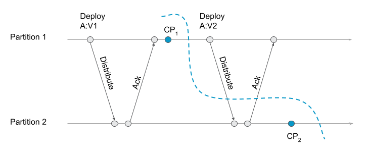
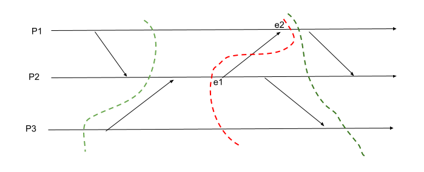
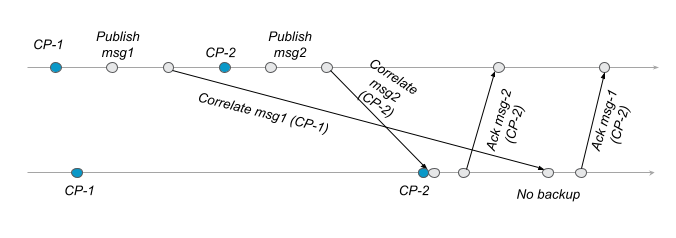
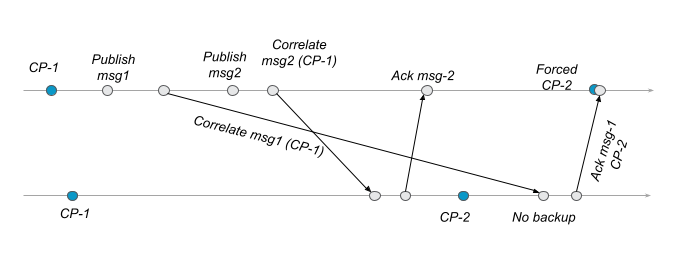

- [Summary](#summary)
- [Motivation](#motivation)
- [Guide-level explanation](#guide-level-explanation)
    - [API](#api)
    - [Internal Backup Process](#internal-backup-process)
- [Reference-level explanation](#reference-level-explanation)
    - [Backup process](#backup-process-in-zeebe)
    - [Edge cases and failure scenarios](#edge-cases-and-failure-scenarios)
- [Unresolved questions](#unresolved-questions)

# Summary
[summary]: #summary

This document describes a concept for taking backup of Zeebe cluster without downtime. We describe how the backup process will be implemented internally. The document focuses on the algorithm for the backup process. The target audience for this document are Zeebe developers.

In Guide-level explanation we describe:
1. API: How a user can take and manage backups. It doesn't explain a concrete api, but only an overview of how the api could look like.
2. Overview of backup process in Zeebe. This explains a high level overview of the algorithm to take the backup. This would help us to understand and reason about the correctness of the algorithm without going to the details.

In the guide-level overview we assume that taking a backup is a synchronous operation and it blocks the stream processor. However, in practice it is not a good idea to block the main processing while taking backup. In reference-level explanation we extend the high-level algorithm to allow taking backups asynchronously. We will implement this extended process in Zeebe. We also describe the failure scenarios and edge-cases in this section and how the algorithm handles such cases.

# Motivation
[motivation]: #motivation

Taking a backup of any system is important. In case of data corruption or failed update, it is required to roll back to an older consistent state.

To take a backup of a zeebe cluster. We can stop all processing and take a backup the data folder. But this means the system is not available during the whole backup process. So a better solution would be to take a backup while the cluster is still running and processing requests.

### Why can’t we take disk snapshots of a running zeebe cluster?

When running a zeebe cluster on a cloud provider, it is possible to take a snapshot of the disk. Most cloud providers offer features like that. However, taking uncoordinated backup leads to following problem.

Consider the following scenario with multiple partitions - partition 1 and partition 2.
1. Partition 1 and 2 has deployments of process A at version 1.
2. Partition 1 takes a checkpoint.
3. Partition 1 receives a new deployment at version 2, it is distributed to partition 2.
4. Partition 2 receives the new deployment
5. Partition 2 takes the checkpoint.




When the restore from the checkpoints, Partition 1 has the deployment at V1 and partition 2 has the deployment at V2. If we create instances for that process, it would create different versions depending on which partition it is created.

There will be similar inconsistencies in message correlation.

The above examples prove why we cannot simply take disk snapshots of the state, or any kind of uncoordinated process to take checkpoints locally.

In a distributed system, a global checkpoint consists of a set of local checkpoints from each participating node. To be able to recover from such a global checkpoint, the local checkpoints have to be in a valid state. In this document, we describe an algorithm by which Zeebe can take a consistent global checkpoint across all partitions without downtime. This global checkpoint forms the backup from which a Zeebe cluster can safely restore from.

# Guide-level explanation
[guide-level-explanation]: #guide-level-explanation

### Definitions

**Backup Store**: A backup store is a remote storage in which backup is stored. A backup storage is shared among all brokers and must be accessible to all brokers. In theory, backup store could be any remote storage such as a remote file system, cloud storage like Google Cloud Storage or S3 buckets. What types of remote storage are supported will be left to the implementation. For this document, we just assume any one of the remote storage type is available.

**Backup Coordinator**: A backup coordinator accepts and responds to client requests to take and manage backups. Backup coordinator will be a node in the Zeebe cluster.

**Backup Id** : A unique integer to identify a backup.

**Zeebe Backup**: Zeebe backup identified by backup id `X` consists of backup `X` of all partitions.

**Backup of a partition**: A partition's backup consists of a snapshot and the compacted log stream.

### API

This section describes how a user can take and manage backups. The API will be exposed in the Backup Coordinator. The minimum api we need for backup management are:
* Take backup
* Monitor backup
* Delete backup

#### Take Backup <backupId>

A user can trigger a backup by sending a `Take Backup` request to the coordinator.
The users must also provide a `backupId`.
A `backupId` is a unique integer that identifies a backup.
`backupId` is ordered. That means, a backup must have an id that is greater than all previous backups.
If two backups are triggered with the same backup id, only one backup will be taken.

The coordinator will acknowledge the request after all partitions have started taking the backup. The acknowledgment will be sent before the backup is completed.
Hence, it is important to have the monitor api to keep track of the backup.

In each partition, the backup consists of the state until the backup is started. The backup will not contain any new records written after the request is acknowledged.

#### Monitor backup <backupId>

A user can monitor the status of the backup by sending monitor request to the coordinator.
The coordinator responds with a status - `doesNotExist | ongoing | completed | failed`.

- `doesNotExist` : `Take Backup` request with this `backupId` was never send.
- `ongoing` : Backup is currently being taken. Monitor again for the status.
- `completed`: Backup is taken successfully. The cluster will be able to successfully restore from this backup.
- `failed`: Backup has failed. A new backup with the same id cannot be taken. When retrying a new `backupId` must be used.

#### Delete backup <backupId>

Zeebe will not prune old backups actively. Instead, users can explicitly delete a backup given its backupId using the delete api. Users can then decide how long to keep a backup or how many backups to maintain.

#### Restore

The user must specify the id of the backup from which Zeebe should restore from. Copying the data and restoring the state from it is done either by Zeebe or an accompanying helper application. Users shouldn't have to do anything manually.

To restore from a backup, all partitions must restore from the same `backupId`. There will be only one backup for a partition in a Zeebe backup. That means, even if it is a replicated cluster, we only keep one replica of a backup per partition. All replicas of a partition must restore from this single backup.

### Internal backup process

Backup of a Zeebe cluster consists of backup of all partitions. A backup of a partition consists of a snapshot and the logStream containing the commands and events after the snapshot position. A partition should be able to restart from this backup the same way it restores its state after a failover or after a normal restart.

For the backup process, we introduce the following concepts:
- A checkpoint : A checkpoint is a logical "point in time" of the system. While a backup is the physical copy of the data that contains the checkpoint.
-  A Checkpoint command : This is the command that marks the checkpoint and triggers the backup process. This is done by a record `checkpoint:create`.
- `checkpointId` : A `checkpointId` identifies a checkpoint. This is same as `backupId` for which we create the checkpoint.
- `checkpointPosition` : This is the position of checkpoint command.

#### Highlevel overview of backup process

This is a high level view of the backup process. The detailed process is described in the Reference-level explanation.

##### Coordinator
A coordinator is a node in the cluster that coordinates the backup process of the partitions. Coordinator is stateless. Coordinator receives a request to take backup from the user and sends a response back to the user regarding the status of the backup.

On receiving a `TakeBackup backupId` request:
- Sends a command `checkpoint:create backupId` to all partitions
- When coordinator receives a response from all partitions, it sends the response back to the user.

##### In each partition
###### StreamProcessor (During processing):
```
On reading a record checkpoint:create :
1. if state.checkpointId < command.checkpointId
    - take a backup
        - Copy the current snapshot and the log until this record in to the backup storage.
    - state.checkpointId = command.checkpointId
    - state.checkpointPosition = command.checkpointPosition
    - write follow up event, `checkpoint:created checkpointId`
2. Send a response to the coordinator (if applicable).
```

###### StreamProcessor (During Replay):
```
- On replaying `checkpoint:created X` event,
    - state.checkpointId=X
    - state.checkpointPosition=event.sourcePosition
```

###### Inter-partition communication
- Any command that is sent from a StreamProcessor to another partition's StreamProcessor will be embedded with the `checkpointId` at the time, the command was send.
- On receiving a command from another partition, the receiving partition first write a new record `checkpoint:create remoteCommand.checkpointId` to the logstream and then write the received remote command. As an optimization, it can skip writing the `checkpoint:create` record if `local checkpointId >= remote checkpointId`.

> Note: Here we described a high level algorithm in which we assumed the backup is taken in a blocking way by the StreamProcessor. Blocking the StreamProcessor while taking the backup is not ideal. In the reference-level explanation, we describe how we can extend the above algorithm and allow asynchronous backups without blocking the StreamProcessor.

##### Example

Consider a system with two partitions. Coordinator sends `checkpoint:create` command to both partitions. There is also inter-partition communication around the same time.

###### Case 1
Two partitions receive checkpoint command around the same time. The following is a representation of the log stream. Each row represents a record (a command or an event).

position | command/event | info |
---|---|---|
11 | .. | lastCheckpointId = X-1 |
12 | checkpoint:create  X | sent by coordinator |
13 | Deployment:Create |   |
14 | checkpoint:created X | follow up of 12 |
15 | Deployment:Distribute | followup of 13 |

position | command/event | info |
---|---|---|
11 | .. | X-1 |  .. |
12 | checkpoint:create X | sent by coordinator |
13 | checkpoint:create X | Written when remote deployment:create was received |
14 | Deployment:Create  | command received from partition 1 |
15 | checkpoint:created X | follow up of 12 |
16 | checkpoint:ignored  | follow up of 13 |
17 | Deployment:Created | followup of 14 |


In this case, both partition takes the backup when the `checkpoint:create` command is received (i.e. processed). Only after taking the backup, they receive the remote command. Since the backup is already taken, the remote command will not force a new backup. In this case, `checkpointPosition` for both partitions is 12.

The backup of the partitions contain the following log stream.

position | command/event | info |
---|---|---|
11 | .. | lastCheckpointId = X-1 |
12 | checkpoint:create X | ... |

position | command/event | info |
---|---|---|
11 | .. | lastCheckpointId = X-1 |
12 | checkpoint:create X | ... |


###### Case 2
Two partitions receive checkpoint command. But one partition receives the remote command before the checkpoint.

position | command/event | info |
---|---|---|
11 | .. | lastCheckpointId = X-1 |
12 | checkpoint:create  X | sent by coordinator |
13 | Deployment:Create |  |
14 | checkpoint:created X | follow up of 12 |
15 | Deployment:Distribute | followup of 13 |

position | command/event | info |
---|---|---|
11 | .. | lastCheckpointId = X-1 |
12 | checkpoint:create X | written when remote deployment:create was received|
13 | Deployment:Create | command received from partition 1 |
14 | checkpoint:create X | sent by coordinator |
15 | checkpoint taken  X | follow up of 12 |
16 | Deployment:Created | followup of 13 |
17 | checkpoint ignored | follow up of 14 |

In this case, partition 2 receives the remote command before the `checkpoint:create` command from the coordinator. The remote command forces partition 2 to take a backup. When `checkpoint:create` command from the coordinator is received, the backup is already taken. Hence, new backup won't be taken. In this case, `checkpointPosition` for partition 2 is also 12.

# Reference-level explanation
[reference-level-explanation]: #reference-level-explanation

In this section we describe the reasoning behind the high-level algorithm from guide-level explanation. Then we extend the high-level algorithm to allow asynchronous backups and discuss the failure scenarios and edge cases.

### What is a consistent backup

A global checkpoint (backup) in a distributed system consists of a set of local checkpoints from the participating nodes. A *consistent* global checkpoint is a set of local checkpoints from which the nodes can recover without any inconsistencies in the state of each node in relation to the state of any other node.

In a few words a global checkpoint is consistent if it is a consistent cut.

To understand a consistent cut, let us introduce the concept of happened before relation.

An event $e_i^h$ occurred in process i at logical time h. A happened before ($\rightarrow$) relation between two events is defined as follows:  
An event $e_i^h \rightarrow e_j^k$  if and only if
 $(i = j \wedge k = h + 1) \vee$
 $(e_i^h = send(m) \wedge e_j^k = receive(m)) \vee$
 $(\exists e_p^n : (e_i^h \rightarrow e_p^n) \wedge ( e_p^n \rightarrow) e_j^k))$

That means an event e1 happens before e2 iff:
- both events happened in the same process and e1 occurred before e2
- e1 sends a message and e2 receives it
- e1 happened before e2 transitively

A cut is a subset of events in the state.
A cut C is consistent if : $\forall e_i, e_j : e_j \in C \wedge e_i \rightarrow e_j \implies e_i \in C$.
That means in consistent cut C, if an event exists in C then all events *happened before* it must also exist in C.




In the above image, the horizontal line depicts the time in each process. The vertical slanted arrow shows communication from one process to another. Dotted lines represent a cut. That means - we take a checkpoint where the dotted line meets the horizontal timeline. The green ones are a consistent cut. The red lines are cuts, but they are not consistent cuts. The red line is not consistent because e2 is in the cut, but e1 is not. e1 has happened before e2 because it is a "send-receive" pair.

### Algorithm to find a consistent cut

[BCS algorithm as proposed in this paper](http://citeseerx.ist.psu.edu/viewdoc/download?doi=10.1.1.149.5565&rep=rep1&type=pdf) is a way to take coordinated consistent checkpoints across multiple processes. (An easy to understand version is [here](https://citeseerx.ist.psu.edu/viewdoc/download?doi=10.1.1.78.4041&rep=rep1&type=pdf)). This is a communication induced checkpointing and relies on lazy coordination among the participating processes.

Here is how the algorithm works.

$C_i^{sn_i}$ is a local checkpoint of process $i$, and its checkpoint id is ${sn_i}$. When a process sends a message, it also embeds its current checkpoint id ${sn_i}$ with it.

A process takes it local checkpoint when
1. A basic checkpoint is triggered. A basic checkpoint is triggered either by an external trigger or it could be something that is triggered periodically.
2. A forced checkpoint is triggered. A forced checkpoint happens when a process received a message from another process, and it is forced to take a checkpoint to guarantee the consistency.

The algorithm is as follows:

*On basic checkpoint:*  
&emsp; $sn_i = sn_i + 1$  
&emsp; take checkpoint $C_i^{sn_i}$

*Upon the receipt of a message m:*  
&emsp; if $sn_i < m.sn$ then  
&emsp; &emsp; $sn_i = m.sn$  
&emsp; &emsp; take checkpoint $C_i^{sn_i}$
&emsp; process message $m$

It has been proven that if we follow the above algorithm, a global checkpoint $C = \{ C_i^{sn_i}, C_j^{sn_k}, C_l^{sn_l}, ...\}$ is a consistent cut if all local checkpoints in $C$ has the same id. $sn_i = sn_j = sn_l = ...$.

#### Correctness of high-level process

The high level process explained in [Guide-level explanation](#internal-backup-process) follows implements the BCS algorithm.

A record in the log stream represents an event in the system. The position of the event can be considered as the logical time when the event occurred.

An event is written to the log at one time, but it is actually processed later. But we consider the event "occurs" when the record is written to the log. So any records that exists before this record has happened before this event.
When a remote command is received by the partition, it is written to the log first. However, we trigger the backup later when it is processed by the `StreamProcessor`. This is correct because when the record is processed by the `StreamProcessor`, the state also reflects the events that have happened before this record. The checkpoint consists of all records until this remote command.

##### Message Reordering

The commands send between partitions are not send over a reliable channel. Hence, `StreamProcessor` has an inbuilt re-try mechanism to handle message losses. As a result, it is possible that the messages are delivered out of order. However, this will not break the backup algorithm. Consider the following case:



In this scenario, reordered messages does not lead to an inconsistent checkpoint.
In $CP-2$, neither of the messages are correlated.



Here, in $CP-2$, message 2 is published and correlated, but message 1 is not correlated. This is ok, because this can also happen in a normal execution. When the cluster restore from this state, message 1 correlation command will be re-send.

### Detailed Backup Process in Zeebe

Taking backup of a partition can take a long time. We do not want to block the `StreamProcessor` during this period. To prevent blocking, we should allow the backup to be taken concurrently to the `StreamProcessor`.
When the backup is taken concurrently, it leads to other challenges. Snapshot is also taken concurrently, and a concurrent snapshot can lead to log compaction. So before the backup is taken, a new snapshot might have been taken resulting in deleting the old snapshot and compacting the log. The new snapshot might be already at a position greater than the `checkpointPosition` rendering the backup to be invalid.
The challenge here is to allow asynchronous backup while preventing concurrent snapshots and compaction from making the backup invalid.

We extend the high-level process described in [Guide-level explanation](internal-backup-process) to allow asynchronous backup as follows.

The components involved in Backup.
* A Coordinator
* BackupStore
In a partition:
	- StreamProcessor
	- SnapshotDirector
	- BackupActor
	- SnapshotStoreActor

###### Coordinator
A backup coordinator is external to all partitions. The gateway could act as a coordinator.

To take a backup `backupId`, coordinator send the command `checkpoint:create backupId` to all partitions.
The coordinator receives an acknowledgment from the partitions when the partitions have started taking the backup (when the StreamProcessor has processed the command). Note that it does not wait until the backup has completed, because it can take a long time.

To monitor the status of a backup, the coordinator sends a request to a partition.
Since this is a query, it does not have to be processed by the `StreamProcessor`. `BackupActor` can check the status of the backup and sends a response. The coordinator then aggregates the status from all partitions.

###### BackupStore
BackupStore is a remote storage where each partition can backup it's data. Backup[N] refers to a backup with id N.

Backup[N][p][b].files = contains backup N of partition `p` started by broker `b`
Backup[N][p][b].status = doesNotExist | ongoing | completed | failed

Backup[N].status = completed if for all partitions p, Backup[N][p].status= completed.
Backup[N].status= failed if for atleast one partition p, Backup[N][p].status=failed.
Backup[N].status = ongoing if for atleast one partition p, Backup[N][p].status=ongoing and Backup[N].status != failed.

###### BackupActor

BackupActor is only active in the LeaderRole because only the leader takes the backup.

On receiving the command `takeBackup checkpointId checkpointPosition` :
```
currentSnapshot = get the current snapshot from SnapshotStore
if currentSnapshot.processedPosition  < checkpointPosition
    "lock" the snapshot by sending a command to SnapshotStore
    if successfully locked start taking backup
    else mark the backup as failed.
else
    mark the backup as failed
```
on Backup Start:
```
 If Backup[N][p][b] already exists
    if Backup[N][p][b] is not completed, delete the backup.
    else if it is completed, then skip the backup
 Initialize Backup[N][p][b].status = ongoing
 Start copying files to Backup[N][p][b].files
	- copy locked snapshot
	- copy all segment files (until atleast the checkpointPosition)
    - store `checkpointPosition` along with the backup
```
> NOTE: When taking the backup, we can copy the records exactly until the checkpointPosition to the backup storage. However as we are concurrently writing new records to the log, we cannot just simply copy the segment files. To simplify the backup process, we can just copy the segment files that includes the records beyond the checkpointPosition. We can then handle them during the restore.

On Backup Completed:
```
Atomically Backup[N][p][b].status = completed
unlock snapshot
```
On Backup Error:
```
Backup[N][p][b].status = failed
unlock snapshot
```
on Replay Completed:
```
N = gets the lastCheckpointId from StreamProcessor
if Backup[N][p][*].status != completed
	then Backup[N][p][*].status = failed
```
###### StreamProcessor:
On reading a command `checkpoint:create`:
```
if state.checkpointId < command.checkpointId
    send a command `takeBackup checkpointId command.position` to BackupActor
    state.checkpointId = command.checkpointId
    state.checkpointPosition = command.checkpointPosition
    write follow up event, `checkpoint:created checkpointId`
If applicable, send a response to the coordinator.
```
During Replay:
```
On replaying `checkpoint:created X` event,
    state.checkpointId=X
    state.checkpointPosition=event.sourcePosition
```
On receiving a remote message from another partition:
```
if local checkpointId < message.checkpointId
    Write `checkpoint:create` to logStream
Write message.command to logStream
```

###### SnapshotStoreActor:
```
On snapshot lock request
	Mark the snapshot as locked in memory
	A locked snapshot should not be deleted until it is unlocked
	When a snapshot is locked, the corresponding logs should be not compacted as well
On snapshot unlock request
	Remove the in-memory lock
	Delete the snapshot if there is a newer snapshot
	Compact the logs
```
###### SnapshotDirector:
Before committing the snapshot check the following:
If `snapshotId.processedPosition < streamProcessor.lastCheckpointPosition < lastWrittenPosition`, then abort the snapshot. This is needed to prevent the scenario where the concurrently taken snapshot has `processedPosition` > `checkpoint position`.

#### On Restore
When restoring from a backup
- Delete all records with position > checkpointPosition

> NOTE: If we copy the exact records to the backup storage, we don't have to do anything extra while restoring. But for simplifying the backup taking process, we allow the backup to contain extra records which we cleanup during restore.

> Restore process should be completed before any normal operation of Zeebe including raft leader election. No new records should be written to the log before restore process is completed.

### Edge cases and failure scenarios

Explain known edge cases and expected failure scenarios and describe how the above algorithm handles them.

##### Edge cases due to concurrent snapshots and compaction

While taking the backup, the available snapshot has `processedPosition >= checkpointPosition`. This would mean that we cannot take a valid backup, because there is no way to retrieve a state that represents the checkpoint until the checkpoint command.

In this there are two scenarios that can happen:

1. The available snapshot is after the `checkpointPosition`. That `snapshotId.processedPosition > checkpointPosition`.
2. The available snapshot was started at a position before `checkpointPosition`, but was taken in parallel to the backup process. In this case `snapshotId.processedPosition < checkpointPosition`. But since the snapshot is taken concurrently, the actual `processedPosition` in the state is > `checkpointPosition`.

To prevent case 1, we fail the backup if `snapshotId.processedPosition >= checkpointPosition`.

In case 2, it is difficult to find the actual `processedPosition` in the snapshot without opening the database. Hence, to be safe, we abort the snapshot if  `snapshotId.processedPosition <= checkpointPosition < lastWrittenPosition`. This means that we abort any snapshot that is taken in parallel to a backup. This is not ideal, but it is a simple solution to prevent inconsistencies.

##### Failure scenarios

Scenario 1:

- StreamProcessor sends "takeBackup" command to BackupActor
- StreamProcess writes "checkpoint taken" record
- Leader change before "checkpoint taken" is committed
- BackupActor did not start taking checkpoint before the leaderchange

This case is fine as it will not lead to any incorrect state. After the leader change, the new leader will process the checkpoint command and triggers the backup again.

Scenario 2:

- StreamProcessor sends "takeBackup" command to BackupActor
- StreamProcess writes "checkpoint taken" record
- BackupActor starts taking checkpoint
- Leader change before "checkpoint taken" is committed

In this case, the new leader process the checkpoint command and triggers the backup again. But a partial backup Backup[N][p][old leader] exists. This is ok. The new leader will start taking the backup to a new location Backup[N][p][new leader] and will commit the new one. The partial backup from the old leader will remain there, which can be pruned in later.

Scenario 3: (this case is very less likely)

- StreamProcessor sends "takeBackup" command to BackupActor
- StreamProcess writes "checkpoint taken" record
- BackupActor starts taking checkpoint
- BackupActor completes taking the checkpoint
- Leader change before "checkpoint taken" is committed

This scenario is very rare because usually the committing `checkpoint taken` record will be much faster than taking a backup.
In this case, the new leader process the checkpoint command and triggers the backup again. But a completed backup Backup[N][p][old leader] exists. The new leader will start taking the backup to a new location Backup[N][p][new leader] and will commit the new one. This is a bit tricky. If the new leader commits a backup with the same id, it is semantically equivalent to the backup from the old leader. So there is no harm in allowing two backups for the same partition. However, this could be confusing and consumes extra storage which is unnecessary. But since it doesn't lead to any inconsistent state, and this scenario is very rare, we can allow this to happen to keep it simple.

Scenario 4:

- StreamProcessor sends "takeBackup" command to BackupActor
- StreamProcess writes "checkpoint taken" record
- BackupActor starts taking snapshot
- checkpoint taken record is committed
- Failover happens before backup is completed

In this scenario, the new leader will not process the checkpoint command. It will only replay `checkpoint taken` record. When replaying it updates the checkpointId and position, but will not trigger a backup. As a result, we have a partial backup for this partition initiated by the old leader. Since the new leader does not take a backup, the backup will never be completed. The coordinator or a user monitoring the backup will observe it as "ongoing" for ever. Inorder to prevent that, we have added a cleanup after the failover. After failover, once the replay is completed, the `BackupActor` marks the previous checkpoint as failed if it is still marked as ongoing.

Note:- In some cases, it might be possible for the new leader to take a consistent backup. But to keep it simple we fail the backup.

Scenario 5:

- StreamProcessor sends "takeBackup" command to BackupActor
- StreamProcess writes "checkpoint taken" record
- BackupActor starts taking snapshot
- checkpoint taken record is committed
- New snapshot is taken with processedposition > checkpoint position
- Failover happens before backup is completed
- New leader starts with the new snapshot at processedPosition > checkpoint position

This is similar to scenario 4. The difference is that the checkpoint taken is not replayed. But everything else is similar. In this case, there is no way for the new leader to take a consistent backup because the snapshot is already past the checkpoint record and it is probably already compacted.

Scenario 6:

- StreamProcessor sends "takeBackup" command to BackupActor
- StreamProcess writes "checkpoint taken" record
- checkpoint taken record is committed
- Failover happens before BackupActor starts taking backup

This is similar to scenario 4. The difference is that there is no "ongoing" backup. But the new leader will still mark it as failed because it will not take a new backup.

Scenario 7:

- StreamProcessor sends "takeBackup" command to BackupActor
- StreamProcess writes "checkpoint taken" record
- checkpoint taken record is committed
- New snapshot is taken with processedPosition > checkpoint position
- Failover happens before BackupActor starts taking backup
- New leader starts with the new snapshot at processedPosition > checkpoint position

This is similar to scenario 6.

Scenario 8:

- StreamProcessor sends "takeBackup" command to BackupActor
- StreamProcess writes "checkpoint taken" record
- BackupActor starts taking snapshot
- checkpoint taken record is committed
- Backup fails due to some errors - such as i/o exceptions

This is outside of our control. The backup can fail due to several reasons such as remote storage is not available, or other i/o errors. We can retry it for a few times before marking the backup as failed.

##### Failure scenarios in coordinator to Zeebe broker communication

- `checkpoint:create` request from coordinator to a partition is lost.
- Acknowledgment from a partition to the coordinator is lost.

In this case, the coordinator can resend the request. It is ok if a partition receives the request twice. Only the first request triggers the backup. The second request will be processed by the streamProcessor, but it will not trigger a backup. Instead it can just send an acknowledgment back to the coordinator indicating that the backup is already ongoing.

What happens if a backup fails?
If a backup failed, the coordinator can see the status via the monitoring query. If a backup fails, there is no use in re-sending the backup request with the same backup id. The users must retry with a new backup id.

##### Rationale for restore process
The backup should contain the snapshot and the log until the checkpoint position. However, while taking the backup, raft will be writing new entries to the log concurrently. To simplify taking the backup, we include extra entries in the backup. Instead, during restore we will fix it by deleting all entries that should not be in the backup.

After restoring from backup X, the last record in the log stream is `checkpoint:create X`. After restoring, StreamProcessor when processing this records updates the `checkpointId` and `checkpointPosition` correctly. and trigger the backup. However, this is ok because we skip taking a new backup in `BackupActor` if there is already a backup.

## Compatibility

The solution introduce new records and add new fields to existing records. This must be done in a backward compatible way.  This is possible as we use SBE for encoding records. The details of this is left to implementation phase.

## Testing

TODO


# Drawbacks
[drawbacks]: #drawbacks

- Backup logic is coupled with StreamProcessor. StreamProcessor must know how to process the newly introduced checkpoint records. The snapshotting process is also involved in the backup process to ensure that the snapshot required by the backup is consistent and not deleted. It would be good if we can make the backup as loosely coupled as possible.

- Backup can fail due to failovers. New leader will not complete a backup that was started by the old leader. Instead, it will mark the backups as failed. If there are frequent leader changes, it may never be able to successfully take a backup.


# Rationale and alternatives
[rationale-and-alternatives]: #rationale-and-alternatives

#### Backup using an exporter

In the contest of backup of camunda 8 cluster, we had discussed one idea where we export all records to an external storage. This external storage will server as our backup storage. The backup will be all records from the beginning. To restore to a particular backup, Zeebe can replay records until a specific position. This is a good idea to decouple backup process from the stream processor. However, this poses new challenges like how to prune the logs from the backup storage. Not pruning the logs will lead the backup to grow unlimited. Also restoring from it can take too long depending on how far in the past we have to start replaying from. To handle this we have to also take snapshots and prune the logs from the backup, which would be either re-running a copy of Zeebe on the backup or we have some way to copy the snapshots from zeebe brokers to the backup and prune the logs. Finding the correct snapshot to include in the backup poses similar challenges in the solution proposed in this document. The challenges such as - how to identify the checkpointPosition to ensure consistency, how to ensure the required snapshot is not deleted before it is copied to the backup etc.


Pros:
1. Less coupled with StreamProcessor.
2. It uses the power of logs as a single source of truth.
3. There is a possibility to extend this idea to other components in C8.

Cons:
1. There are still a lot of challenges to resolve
    - How to ensure that the backup is consistent. For this we can apply the solution proposed in this document. That is using the checkpoint command and embedding checkpointId in remote commands. We can use this to identify the checkpointPosition until which to restore from.
    - How to prune the logs. This poses similar challenges as in the proposed solution such as how to ensure that there is a snapshot at the expected position. Ensuring that snapshot + logs is a valid backup and so on.
    - How can Zeebe replay from records in the external storage etc.
    - This would require a database to which we can export the records. While the proposed solution can be applied to a simple remote file system.
2. Due to the above challenges, I feel that this idea will be equally or more challenging than the proposed solution.
3. It is an active process. The backup is a continuous process rather than
 something controlled by the user.

# Prior art
[prior-art]: #prior-art

* The proposed API is inspired from ElasticSearch's api for backups. Similar to what we proposed, the request to take the backup does not wait until the backup is completed. Instead there is a "GET" api to query the status of the backup.

# Out of scope
[out-of-scope]: #out-of-scope

<!--
Call out anything which is explicitly not part of this ZEP.
-->

# Unresolved questions
[unresolved-questions]: #unresolved-questions

### What parts of the design do you expect to resolve through the ZEP process before this gets merged?

- All failure cases must be acknowledged. ZEP must describe how the failure cases are handled.
- Known edge cases are listed, and the solution must handle them.
- Algorithm/design must be correct.
- How to test

### What parts of the design do you expect to resolve through the implementation of this feature before stabilization?

###### How to implements restore operation and the restore api.
I see several ways to achieve this without changing the fundamental concept.
1. Zeebe implements the restore operation. We can start Zeebe with a special flag, which executes the restore operation before the normal bootstrap. Or Zeebe can initiate a restore operation while it is still running.
2. We can have a helper application that can be run in each broker before they are started. In k8s environment this could be an Init container for example.

This must be defined during the implementation phase.

###### Record format and backward compatibility
We have to introduce new records for the checkpoints. What would it look like, and how to do it in a backward compatible way is left to the implementation phase. Some challenges to solve here are:
- The new records must not be added to the process engine records to not break the abstraction between the stream processing and the engine. This is challenging as currently we have only engine records.
- Processing of the new records must not be done by the engine. We should add new "processors" and "event appliers" independent of engine processors.

###### Remote storage
What types of remote storage will be available and how to configure Zeebe to use a specific storage for backup is left to implementation phase. In the first version we would most like choose one remote storage for the backup. It would be interesting to see if we want to support more storage type in future.

###### The implementation of the coordinator and the API

ZEP only described a high level idea of the api. It make sense to make the Gateway as the coordinator as it is the point of contact for the clients. How to expose the backup management api in the gateway is left to the implementation phase. We can expose it via the grpc api or via rest-api over spring actuators like the other admin operations. The details of this is left to the implementation.

### What related issues do you consider out of scope for this ZEP that could be addressed in the future independently of the solution that comes out of this ZEP?

Backup Integrity: This was raised by the reviewers. The question was how to verify the integrity of the backup during restore. This is out of scope for this ZEP.  We can find a solution later independent of the solution proposed in this ZEP.

Misconfiguration: What would happen if each broker is configured with a different backup storage. If this happens, in the worst case, the brokers cannot find the backup to restore from. Preventing this case is out of scope for this ZEP.

Garbage collection: We do not provide a solution for garbage collecting old or failed backups. ZEP proposes to expose a delete api which users can use to explicitly delete backups.

# Future possibilities
[future-possibilities]: #future-possibilities
