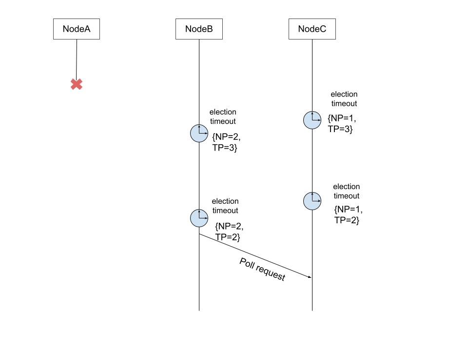

# Summary
[summary]: #summary

<!--
One paragraph summary of the feature
-->

# Motivation
[motivation]: #motivation

In Zeebe, there is no way to control which nodes becomes the leader of which partition.
The raft leader election is based on randomized timeout values which is not controllable.
As a result, leaders are frequently concentrated in a small number of nodes.
Because leaders typically do more work than followers, this situation can easily become a performance bottleneck.
In our performance benchmark, we found that when one node is the leader for all three partitions, the total throughput of the system is much lower than when each node is the leader for one partition.
This situation is also inefficient in terms of resource allocation.
We should always over-provision nodes to get good performance.
Therefore, to improve the performance of the system and for an optimal resource usage, it is required to distributed the leaders uniformly among the nodes.

Although the ideal state is to have a strictly uniform distribution of leaders, it is often not possible. A node restart triggers fail-over and re-distribution of the leaders.
When this node comes back it is highly likely that it cannot become the leader, because it's log is not up-to-date.
Forcing a re-distribution of leaders at this time is also not ideal, because during the fail-over the system is partly non-available.
Hence, our current goal is not to get strict uniform distribution. We aim for a best-effort distribution of leaders.

Expected outcome:
 * After a cluster start or restarts, we aim to get more or less uniformly distributed leaders.
 * When the current leader dies, the new leaders would be distributed equally in the rest of the nodes in a best-effort way.

Note that it is not always possible to equally distributed the leaders.

# Guide-level explanation
[guide-level-explanation]: #guide-level-explanation

We aim to achieve uniform leader distribution by priority based election.
This means, a node with higher priority has a better chance of becoming the leader.

Each raft node has a `nodePriority` and a `targetPriority`.
The `nodePriority` is assigned according to its priority to become a leader.
Higher the `nodePriority`, higher the chance of becoming the leader.

When the `electionTimeout` triggers, instead of immediately sending a poll request, the node first compares the `nodePriority` with the `targetPriority`.
The node starts the election by sending poll requests only if `nodePriority >= targetPriority`. If the node cannot start the election, it waits for another `electionTimeout`. If there is no new leader elected by that time, the node reduces it's `targetPriority` by `priorityDecay` and repeat the above steps. In this way, the node with the highest priority starts election first and thus has a higher chance of getting elected as the new leader.

Consider the following scenario:  
NodeA : {nodePriority = 3, targetPriority = 3}  
NodeB : {nodePriority = 2, targetPriority = 3}  
NodeC : {nodePriority = 1, targetPriority = 3}  

NodeA is the current leader and it dies. `priorityDecay = 1`.



# Reference-level explanation
[reference-level-explanation]: #reference-level-explanation

The priority election is implemented by the follower.
Previously, on a heartbeat timeout the follower immediately starts an election by sending a poll request.
The heartbeat timeout was randomized, in order to prevent multiple nodes starting the election at the same time.
With the priority election we do not use a randomized heartbeat timeout.
Instead, we use the configured electionTimeout.
On heartbeat timeout, the follower implements the following algorithm.


```java
onHeartbeatTimeout() {
    if(nodePriority >= targetPriority) {
        sendPollRequest();
    } else {
        // reduce priority in the next heartbeatTimeout
        heartbeatTimer = schedule(electionTimeout, () -> {
            targetPriority = targetPriority - priorityDecay;
            onHeartbeatTimeout();
        })
    }
}
```


### Assigning priority

The node with highest priority is called the primary for the partition.
If a node is primary for two partitions a and b, then the next priority for each partitions should be assigned to different nodes.

Here is an example how we assign the priorities. Each node gets a priority value for each partition.

| node\partition | 1 | 2 | 3 | 4 | 5 | 6 |
| --------       |:------:| -----:|:-----:| -----:|:------:| -----:|
| 0              | 3 | 1 | 2 | 3 | 2 | 1 |
| 1              | 2 | 3 | 1 | 1 | 3 | 2 |
| 2              | 1 | 2 | 3 | 2 | 1 | 3 |

Node 0 is the primary for partitions 1 and 4. If node 1 has the next priority for both partitions, then when node 0 dies node 1 will become the leader for both partitions.
This is not optimal as the leadership is not balanced. Hence it is preferable to make different nodes as the secondary priorities. As in the above example, node 1 is the secondary for partition 1, while node 2 is the secondary for partition 4.

Here is how the priority is assigned.
The primary node get the highest priority which is equal to the replicationFactor.

```java
primaryMember.priority = replicationFactor;
if(partition/clustersize  % 2 == 0) {
    nextPriority = 1;
    foreach (member : nonPrimaryPartitionMembers) {
        member.priority = nextPriority;
        nextPriority++;
    }
} else {
    nextPriority = replicationFactor - 1
    foreach (member : nonPrimaryPartitionMembers) {
        member.priority = nextPriority;
        nextPriority--;
    }
}
```

We propose to have the priorities in the range of 1 to `replicationFactor` and set `priorityDecay` to 1.
Since the system does not allow dynamic change of the configuration, we can calculate and assign the priorities when the partition distribution is generated.
The priorities will be part of `PartitionMetadata`.

### Possible issues and corner cases
1. If even after multiple rounds of election no new leader is elected, it is possible that all nodes starts election at the same time and enters an election loop. <To be verified>
2. In normal cases, the election can take up to ((quorum + 1) * electionTimeout) until a new leader is elected.

We are not going to discuss solutions for the above problems in this document.

### Changes to configuration

Although it might be useful to let the user configure priority for the nodes, for the initial version, we propose to assign priority automatically.
We expose a feature flag to turn on/off priority election.
If the feature flag is turned off, the default raft leader election will be followed.

## Compatibility

There are no known compatibility issues.

## Testing

* The election itself will be tested via existing unit tests
* Since how leaders are elected is only semi-deterministic, we cannot have a unit test to check if the primaries are becoming leaders.
* To evaluate if the priority election is useful to distributed leaders uniformly, we will run a benchmark and restart nodes/cluster while measuring the number of leaders per node. If the max leaders per node is below a threshold, we would consider it as a balanced leadership. We will then count the number of times the leadership is balanced. `successCount/totalCount` give us the probability of getting a balanced leadership.

# Drawbacks
[drawbacks]: #drawbacks

* Election latency increases. In normal cases, the election can take up to ((quorum + 1) * electionTimeout) until a new leader is elected. In the default algorithm the latency can be up to 2 * electionTimeout. There can be exceptions, and it can take longer in case of failures. But these values are expected in a normal case.
* Uniform leadership is not guaranteed. The algorithm is only semi-deterministic. The leader distribution depends on several other factors like the timing, if the node are eligible to become leader and so on.

# Rationale and alternatives
[rationale-and-alternatives]: #rationale-and-alternatives

Alternatives:

#### Strict leader transfer defined in raft paper.
Raft paper proposes a protocol for transferring leadership from one node to the other.
This protocol is guaranteed to transfer the leadership (in case of no failures).
Thus, it is useful if we want to have a strictly uniform distribution.
The leadership transfer happens when it is externally triggered.
We did not choose this approach because:
1. This is a more complex solution. There are several failure cases to be considered to ensure that it is safe and correct.
2. Needs an external trigger to start balancing leader. This would mean either a heuristic based automatic trigger with in the system or exposing an api to manually trigger the leader distribution operation.
3. We are not aiming for strictly uniform leader distribution.

In the long run this approach might be useful. Running priority election does not block us from implementing this approach. We can have both if needed.


#### Multi-raft aware raft partition node

A raft partition node knows about other partitions in the same node.
On election timeout, the partition checks if the number of leaders in the node is below a threshold. If yes, it starts an election. Otherwise, it doesn't trigger the election.
Thus, the number of leaders in the node is kept under the threshold.

We did not choose this approach because:
1. A partition is aware of other partitions.

#### On bootstrap primary starts election immediately
To ensure that on cluster start the primary becomes the leader, we can let the primary starts sending poll requests immediately after it is started.
This might trigger an election even if there is an existing leader.
It is possible to implement this behavior together with the priority election.


#### Priority based election timeout
Instead of a randomized election timeout, the election timeout are assigned based on the priority.
The node with the highest priority has a lower timeout, than the node with the lowest priority.
This way the highest priority node will start the election first and thus has a higher chance of becoming the leader.
We did not choose this approach because it is almost similar to the priority election discussed in this document. We do not see any advantage over priority election. There might be corner cases which we have to test and optimize.
Since the priority election is already implemented and tested in other raft implementation, we decided not to investigate more time in this approach.

We decided to chose priority election because:
1. The solution can be implemented with in a raft partition.
2. It is easy to implement.
3. No external trigger required.
4. In future it gives us the opportunity to make the priority configurable and thus a user can control how the leaders are assigned.

# Prior art
[prior-art]: #prior-art

The priority election proposed in this document is implemented in another raft based system - sofa-jraft. https://www.sofastack.tech/blog/sofa-jraft-priority-election/

# Out of scope
[out-of-scope]: #out-of-scope

* Exposing an api to manually balance leaders

# Unresolved questions
[unresolved-questions]: #unresolved-questions


# Future possibilities
[future-possibilities]: #future-possibilities

1. Reduce election duration. Some ideas:
    - If the current leader is the primary, the secondary can immediately starts the election if the primary dies. No need to wait until the priority is reduced.
    - After the first election timeout, the timeouts in the next rounds can be reduced. There is no advantage in waiting for another electionTimeout.
2. Exposing an api to trigger leader distribution.
3. Allow users to configure priorities.
4. Dynamically assign priorities based on other properties. For example, if a node is overloaded it may reduce the priority for some partitions so that it doesn't become the leader.
